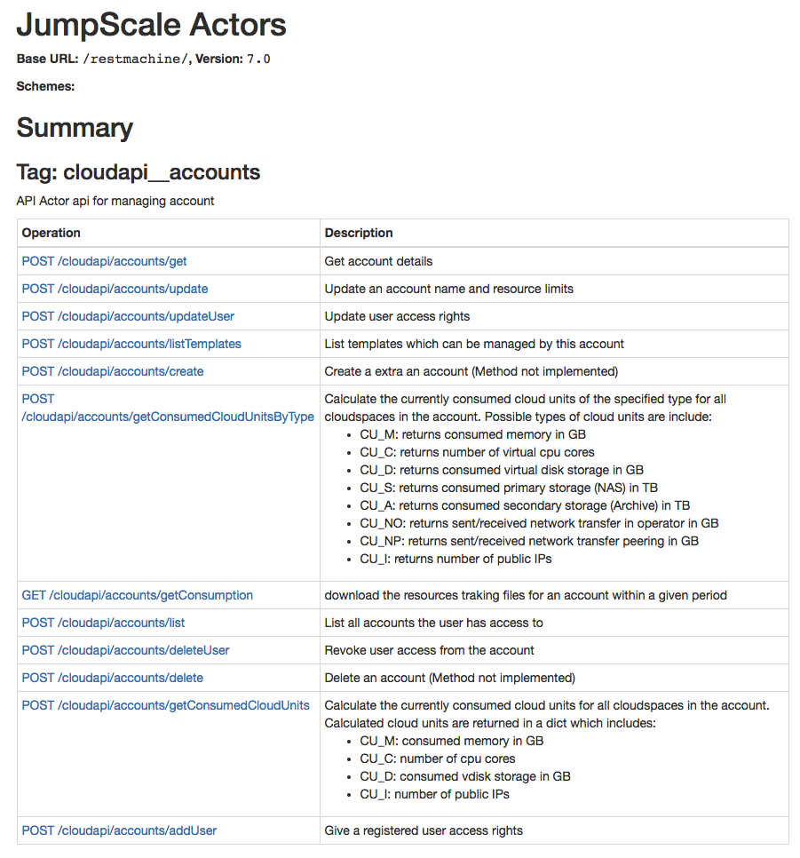

# Create Static HTML Page for API Documentation

We recommend using [bootprint](https://www.npmjs.com/package/bootprint-swagger) for this, which converts any [OpenAPI-Specification](https://en.wikipedia.org/wiki/OpenAPI_Specification) into a static HTML-page.

This is done in 5 steps:
- [Install Node.js](#install-nodejs)
- [Install Bootsprint](#install-bootprint)
- [Get a JWT to authenticate against OpenvCloud](#get-jwt)
- [Get the OpenAPI specification from your OpenvCloud environment](#get-openapi)
- [Generate the static HTML page with Bootprint](#generate-html)


<a id="install-nodejs"></a>
## Install Node.js and npm the, Node.js package manager

See the [offical Note.js site](https://nodejs.org/en/).

For Linux this is done as follows:
```
sudo apt-get update
sudo apt-get install nodejs
sudo apt-get install npm
```


## Install Bootprint

```bash
npm install -g bootprint
npm install -g bootprint-openapi
```


<a id="get-jwt"></a>
## Get a JWT to interact with OpenvCloud

First create an API key in the **Settings** page of your [ItsYou.online](https://itsyou.online/#/settings) profile page:


First copy the generated values of `Application ID` and `Secret` in the `CLIENT_ID` and `SECRET` environment variables:
```bash
CLIENTID="..."
SECRET="..."
```

Get the JWT into another environment variable:
```bash
JWT=$(curl -d 'grant_type=client_credentials&client_id='"$CLIENTID"'&client_secret='"$SECRET"'&response_type=id_token' https://itsyou.online/v1/oauth/access_token)
```


<a id="get-openapi"></a>
## Get the OpenAPI specification from your OpenvCloud environment

```bash
G8="https://be-gen-1.demo.greenitglobe.com"
curl -o openAPI.json -H 'Authorization: Bearer '$JWT $G8/restmachine/system/docgenerator/prepareCatalog?actors=&group=cloudapi&format=jsonraw
```

Press `ctrl+c`.


<a id="generate-html"></a>
## Generate the static HTML page with Bootprint

First create a target directory for the static HTML web page:
```bash
mkdir html
```

Generate the static web page:
```bash
PACKAGE_DIR=$(npm config get prefix)
$PACKAGE_DIR/bin/bootprint openapi openAPI.json html
```

Check the result in your browser of choice, here in Chrome:
```
open -a "/Applications/Google Chrome.app" html2/index.html
```



Or make it available as an archive, here using `tar`:
```bash
tar -cvzf G8_CloudAPI_Doc.tar.gz html
```

For details about the Bootprint command line parameters, refer to the [documentation of Bootprint](https://github.com/nknapp/bootprint).
