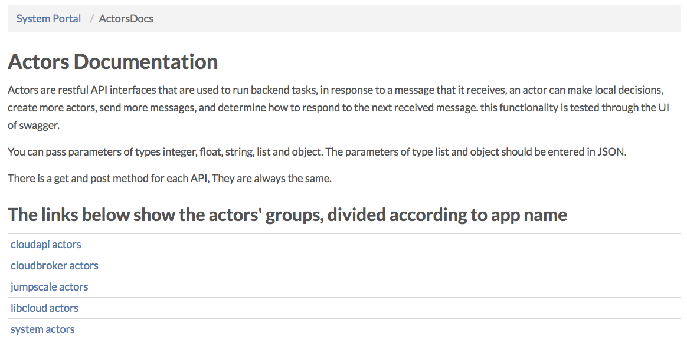
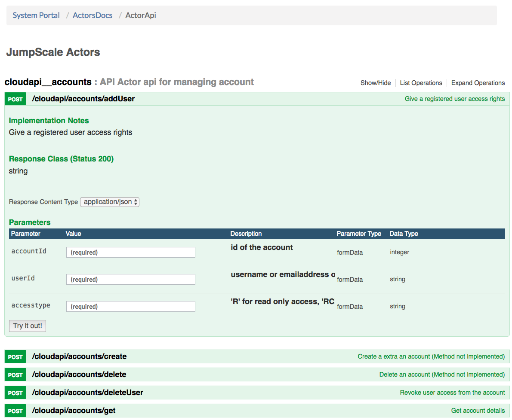

# OpenvCloud API

Clicking "API" in the **System Portal** brings you to the **Actors Documentation** page:

Here you find five actor categories, only the first two are supported:
- **CloudAPI** actors: the API publicly available to all users
- **CloudBroker** actors: API available only to administrators, providing the functionality as available from the Cloud Broker Portal and the Grid Portal

The three other API groups are only for internal use:
- **JumpScale** actors: internal API for managing the firewalls
- **LibCloud** actors: internal API used during configuration and setup
- **System** actors: all other internal system APIs

All the APIs are described in the [OpenAPI Specification](https://en.wikipedia.org/wiki/OpenAPI_Specification).

Through the [Swagger UI](https://swagger.io/swagger-ui/) you can interact with them, here for the **Add User** API endpoint:

While all documentation for using this API is nicely included in this Swagger API console, you can also create a static HTML web page for the API documentation as documented in [Create Static HTML Page for API Documentation](OpenAPI2HTML.md).

In order to get stared with the Cloud API check [Getting started with the OpenvCloud Cloud API](GettingStarted.md).
