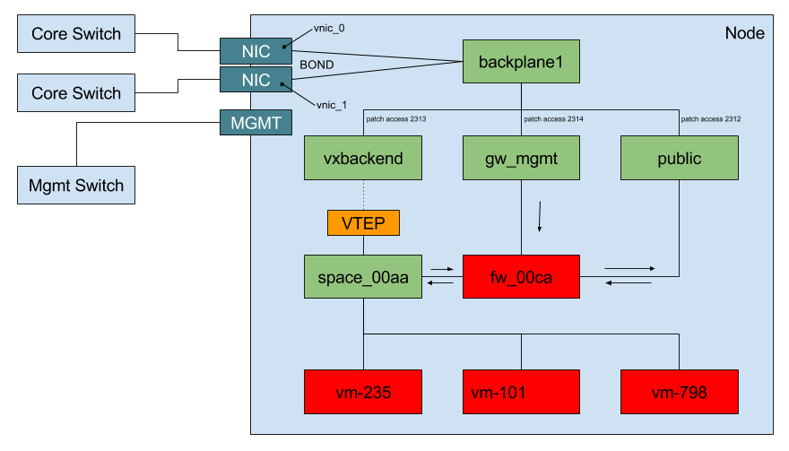

## Internal Node Network

The above diagram only shows one cloud space:

- 3 virtual machines
- 1 virtual firewall
- 1 virtual switch, connecting the cloud space to the VXLAN (via the VTEP)

Color scheme:

- Red: virtual machines
  - The one that is labeled as `fw_00ca` is running the MikroTik RouterOS, turning the VM into a network router; there is one per cloud space, implementing various additional features, such as firewalling
  - The other ones in the picture are the virtual machines created for running end-user workloads
- Green: Open vSwitch virtual switches
  - The one that is labeled as `space_00aa` is the virtual switch of the cloud space VXLAN
  - `public`
  - `gw_mgmt`
  - `vxbackend`
- yellow: VXLAN tunnel endpoints (VTEPs)
