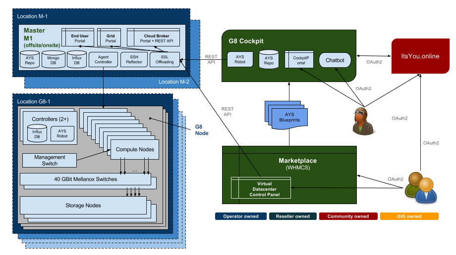

## Solution Blueprint

The G8 solution consist out of several key components:

- the actual G8s (pronounced as "generates"), together they form a G8 grid. These are the physical nodes that provide IT capacity (CPU / Memory / Storage / Networking)
- the G8 Master, logically installed on 2 geographically separated G8s. These are the nodes that run all software / databases / portals / RestAPI's that manage all G8s in the G8 grid.
- the G8 Cockpits. Several of these G8 Cockpits connect to 1 or several G8 Masters. G8 Cockpits deliver several important functions: full lifecycle management for applications that use G8 resources, Chatbot capability to deploy application instances on G8s, versioning control for all instances created on the G8 grid through the G8 Cockpit, ...
- ItsYou.online, an independent OAuth 2.0 authentication service used to authenticate all users that interact with the G8 solutions. See https://gig.gitbooks.io/itsyouonline/content/

Below a more detailed introduction to each of the components:

### CPU Nodes

The actual servers that deliver compute capacity, memory and networking are called CPU Nodes. One G8 in one location can have several CPU Nodes.

The CPU nodes run several functions:
- Hypervisor (KVM and QEMU)
- Virtual machines
- Virtual routers
- All IT loads
- Storage Front Ends

## Storage Nodes

The storage nodes run the integrated G8 Storage.

### Controllers

Two or more small nodes installed local to the G8 physical nodes for managing/monitoring the G8 physical nodes.

Functions: 
- Boot/Install server driven by AYS (abreviation for "At Your Service" - for more information go to https://gig.gitbooks.io/jumpscale-core8/content/AYS/AYS-Introduction.html)
- AYS used to deploy all software on nodes
- Monitoring services and collect statistics in the InfluxDB

### Switches

Each G8 has 2 redundant RDMA capable switches. In addition one management switch delivers the management network and the IPMI functionality.