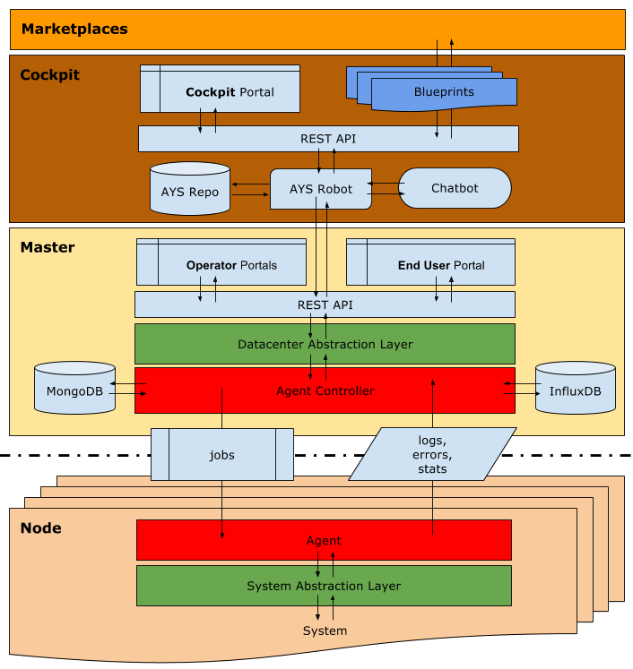

## Components

In what follows all components are dicussed botton-up.

### System Abstraction Layer

The **System Abstraction Layer** (SAL) is a thin abstraction layer making it easy for developers to interact with all system components at the level of a server node.

For more details check the [SAL documentation in the GitBook covering JumpScale 8 Core](https://gig.gitbooks.io/jumpscale-core8/content/SAL/SAL.html).

### Node

In this context a node is a server node typically running the Ubuntu OS or - in the most recent G8 installations - the G8-OS.

### Agent

On each server node an **Agent** is responsible for executing jobs received from the **Agent Controller**. These jobs are actually **JumpScripts**, which are Python scripts interacting with the system through the **System Abstraction Layer**.

Logs, errors and statistics collected by the **Agent**  from the running **JumpScripts** are fed back to the **Agent Controller**.

### Master

Each single-location or multi-location OpenvCloud environment is managed from a **Master**. This is a collection of virtual machines or Docker containers running in the **Master Cloud Space** on a remote location, physically separated from OpenvCloud server nodes it orchestrates.

For more details about the **Master Cloud Space** and how to access it see the [How to Connect to an OpenvCloud Environment](../Sysadmin/Connect/connect.md) section.

### Agent Controller

The **Agent Controller** acts as a job controller distributing work to the **Agents**.

Since server nodes are not publicly accessible all communication between the **Agents** and the **Agent Controller** happens throug HTTP Long Polling initiated by the agents.

### Datacenter Abstraction Layer

Also implemeted by JumpScale 8 Core components is the **Datacenter Abstraction Layer** providing developers an interface to interact with the **Agent Controller**, and thus the server nodes.

### Master REST API

Both local and remote interactions with the **Datacenter Abstraction Layer** happens through REST API.

### Operator Portal

Operators administer their OpenvCloud environment through the Operator Portal, which are actually the [Cloud Broker Portal](../CloudBrokerPortal/CloudBrokerPortal.md) and the [Grid Portal](../GridPortal/GridPortal.md).

The portals are created using the **JumpScale Portal Framework** that features wiki pages that interact with the REST APIs through macros.

### End User Portal

End users have access through the **End User Portal**, which is another portal created using the **JumpScale Portal Framework**.

### Cockpit

From a **Cockpit** you interact with one or more **Masters** for managing the full lifecycle a workloads (services) consuming capacity from the OpenvCloud environments controlled by the **Masters** it connects to through their REST APIs.

### AYS Robot

Key features of the **Cockpit** are **AYS** (abreviation for "At Your Service") and the **AYS Robot**. **AYS** is a self-healing lifecycle management solution for a G8 cloud infrastructure and the workloads (virtual datacenters, virtual machines, Docker containters, applications/services, virtually anything) running on a G8 cloud. See the [section about AYS](../AtYourService/AtYourServiceIntro.md) for more details. The **AYS Robot** is the component that is actually responsible for orchestrating all work, including picking up blueprints and executing them, and also tasks such as monitoring the system and all workoads and trigger (self-healing) actions, as defined in AYS service templates.

### Blueprints

**Blueprints** are human readeable files to describe a full solution/workload or a change request to an existing solution. Such a solution can for instance be a virtual datacenter, or a virtual datacenter hosting a web application, of which of the services all run in a sepaerate Docker container. The solution or change request to the solution can be as sophisticated as required. A blueprint allows you declaritivelly specify exactly what you require, hidding all complexities.

### Cockpit Portal

The **Cockpit Portal** is a web portal for administrating the Cockpit.  

### Cockpit Chatbot

All functions exposed in the **Cockpit Portal** are also available through a chatbot active on **Telegram**.

### Marketplaces

Customers typically interact with an G8 environment via a **Marketplace** where they can order virtual datacenters and applications hosted in virtual datacenters, which are provisioned through blueprints via the Cockpit. Green IT Globe provides a WHMCS-based reference implementation of such a marketplace on GitHub, as documented here: https://www.gitbook.com/book/gig/g8-whmcs-reference-implementation/details
