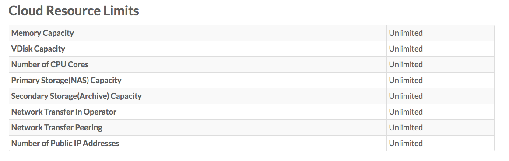
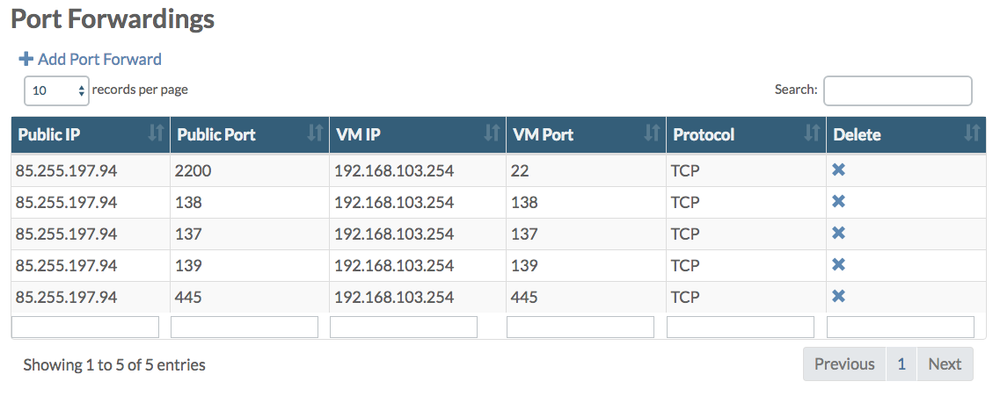
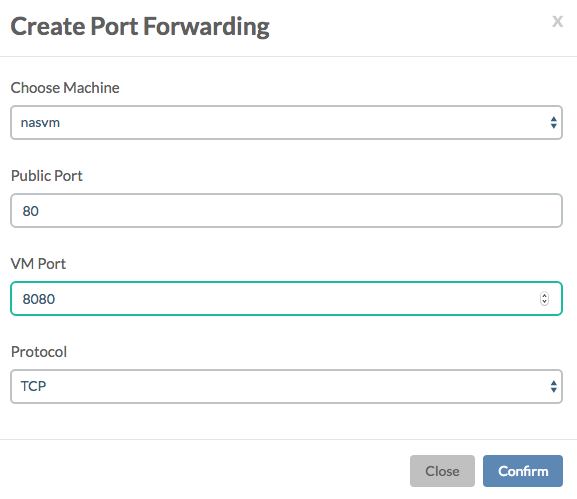
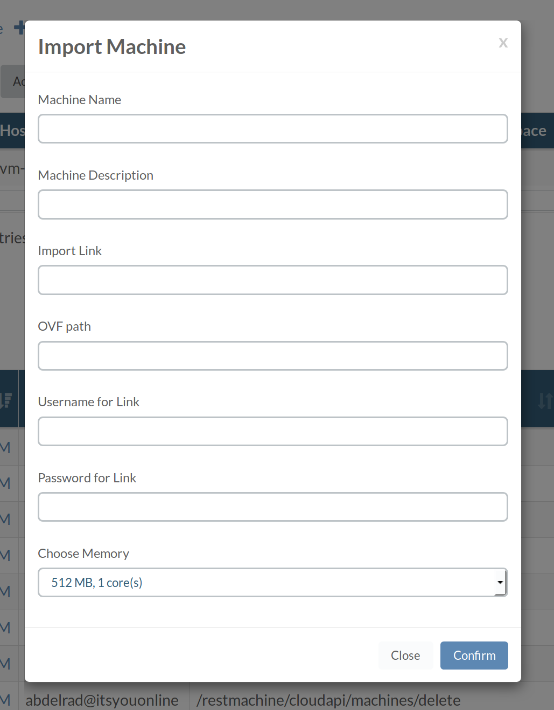

## Cloud Spaces

A cloud space is logical grouping of cloud resources, commonly referred to as a tenant.

Each cloud space is associated with one, and only one account. Per account you can have one or more cloud spaces, that are all associated with the same account.

The **Cloud Spaces** page lists all cloud spaces:

![[]](CloudSpaces.png)

From there you can navigate to the **Cloud Space Details** page of a specific cloud space:

![[]](CloudSpaceDetails.png)

From the **Actions** dropdown on the **Cloud Space Details** page you can choose to:
- **Edit** the cloud space name and capacity limitation properties
- **Deploy VFW** in order to deploy the virtual firewall (VFW) (if not active already, since this normally happens automatically)
- **Delete** the cloud space

For each new cloud space a private network (including a virtual firewall) is automatically created, shared by all virtual machines in that cloud space. In the **Details** section of the **Cloud Space Details** page this private network is referenced with its **Network ID**. When you click this **Network ID** you navigate to the **Private Network Details** page for that cloud space:

![[]](PrivateNetworkDetails.png)

Here you also see the **Management IP Address** and the **Public IP Address** for the cloud space, as well as all active port forwardings on that private network; discussed below.

### Cloud Resource Limits

Here the total available cloud capacity is show.

In order to change the limits you need to select **Edit** from the **Action** dropdown menu.

#### User Access

In the **Users Access** section you see all the users with access to the cloud space:

![[]](UsersAccess.png)

By clicking the **+ Grant User Access** link you can grant other users to the cloud space:

![[]](GrantUserAccess.png)

A user can have **read**, **write** or **admin** privileges. See the [End User Portal Authorization Model](../../EndUserPortal/Authorization/AuthorizationModel.md) documentation for all details on this.

#### Port Forwards

In order to make virtual machines on the cloud space publicly accessible you will need to set-up port forwards from the public network to the private network.

Clicking **+ Add Port Forward** allows you to add Port Forwards:

#### Virtual Machines

In the **Virtual Machines** table all virtual machines running in the cloud space are listed.

![[]](VirtualMachines.png)

Click the **+ Add Virtual Machine** in order to add a new virtual machine in the cloud space which will pop-up the **Create Machine On CPU Node** window:

Click the **+ Import Virtual Machine** in order to import a new virtual machine in the cloud space which will pop-up the **Import Machine** window:

Form data:

* **Machine Name**: New name for the machine to import
* **Machine Description**: Description for new machine 
* **Import Link**: `HTTP(S)` link to your WebDAV server
* **OVF Path**: Path toward the directory on your WebDAV server where the export data lives
* **Username for Link**: Username for your WebDAV server
* **Password for Link**: Password` for your WebDAV server
* **Memory**: Choose the memory you would like to assign to your new machine

