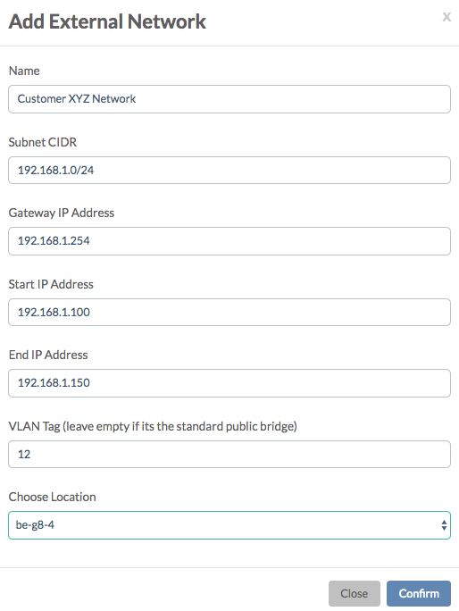
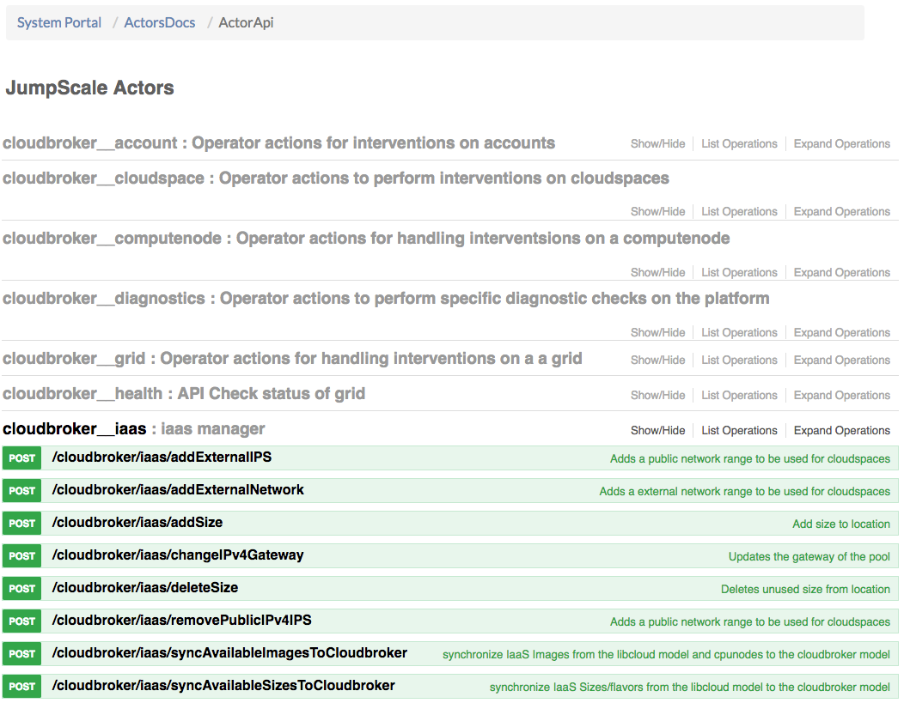
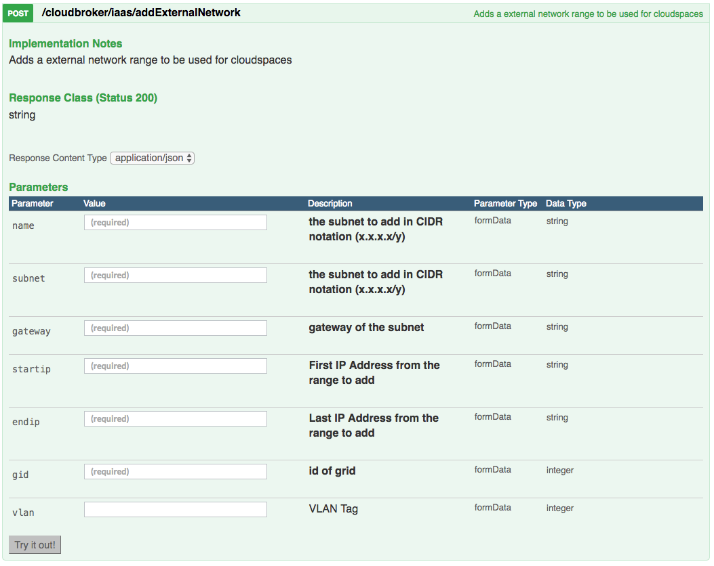
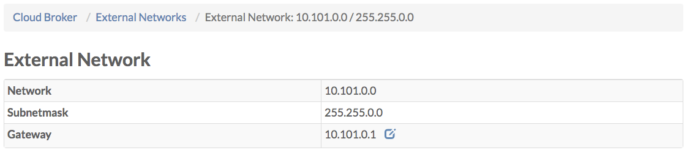
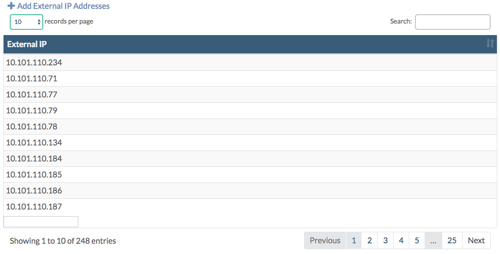

## External Networks

The **External Networks** page lists all connected external networks:

Clicking **+ Add External Network** allows you to add an external network:

In the above example 50 (192.168.1.100 -> 192.168.1.150) of the 256 IP addresses on the external network 192.168.1.0/24 are attached to the location be-g8-4.

Not shown in the screenshot, is the **Account ID** allowing you to make an external network available to only one specific account.

The API that exposes this functionality is part of the **CloudBroker Actors**, available through the **API** page of the **System Portal**, under **cloudbroker__iaas**:

There you will find the **/cloudbroker/iaas/addExternalNetwork** API:

From the **External Network Details** page you can click through to the **External Network Details** page for any of the listed external networks:

Under the section **Free IPs** all free IP addresses are listed:

Next all **cloud spaces** are listed that use one of the external network IP addresses:

Also all **virtual machines** are listed that have been connected directly to one of the external network IP address.
