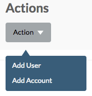

## Cloud Broker Portal Home Page

On the home page there are three sections:
- [Dashboard](#dashboard)
- [Locations](#locations)
- [Accounts](#accounts)

### Dashboard
Here three gauges report about the number of active accounts, the number of running virtual machines and the number of running virtual machines using Windows:

The **Actions** dropdown menu provides access to the frequently used actions **Add User** and **Add Account**:

Also a link to the [Status Overview](../../GridPortal/StatusOverview/StatusOverview.md) page is included.

### Locations
Here all the locations are listed, linking to the **Location Details** pages:

### Accounts
And finally all the accounts are listed, linking to the **Accounts Details** pages:

