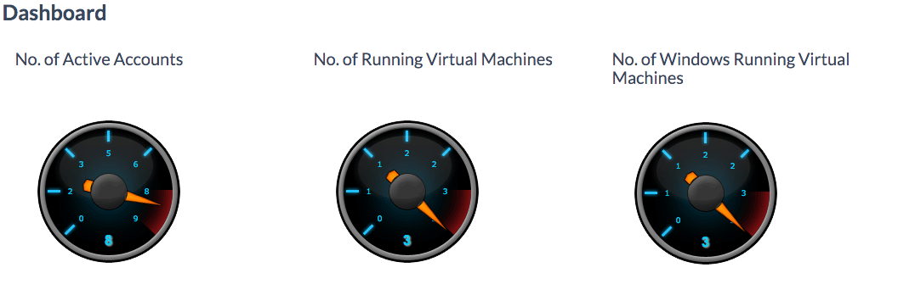
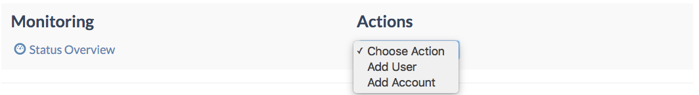
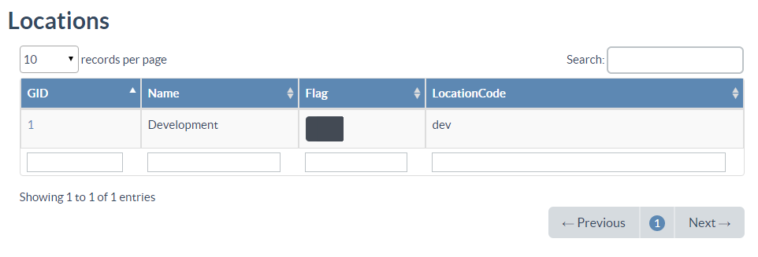
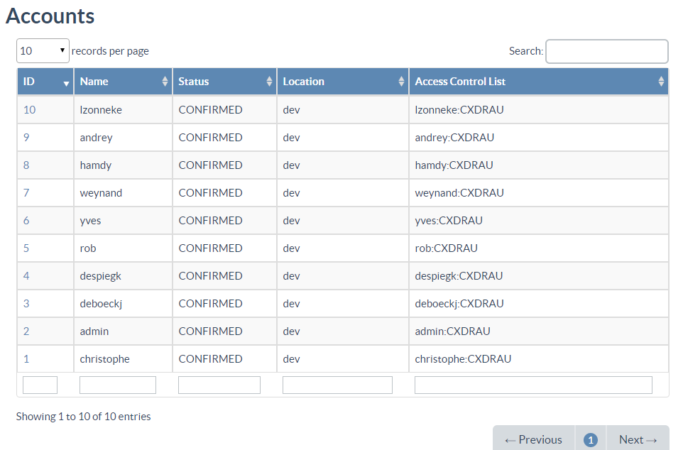

### Cloud Broker Portal

The **Cloud Broker Portal** is one of the sub portals used by operators to manage all the clouds:

* **Cloud Broker Portal**
* Grid Portal
* At Your Service Portal
* Power Management Portal
* Storage Portal
* System Portal

 The **Cloud Broker Portal** is the management interface, or broker, on top of all the clouds. The current implementation of the **Cloud Broker Portal** supports GigStack clouds. Support for other clouds, including OpenStack clouds, is under development.

In the **Cloud Broker Portal** operators deal with [Accounts](../Accounts/Accounts.md), [Cloud Spaces](../CloudSpaces/CloudSpaces.md), [Locations](../Locations/Locations.md), [Stacks](../Stacks/Stacks.md), [Images](../Images/Images.md), [Public Networks](../PublicNetworks/PublicNetworks.md), [Private Networks](../PrivateNetworks/PrivateNetworks.md), [Users](../Users/Users.md), [Groups](../Groups/Groups.md) and [Virtual Machines](../VirtualMachines/VirtualMachines.md).

The **Dashboard** section shows the number of active accounts, the total number of running virtual machines and the number of running Windows virtual machines:

Under **Monitoring** there's a link to the Status Overview page which is part of the **Grid Portal**, and a list of frequently used actions, **Add User** and **Add Account**:

In the **Locations** section all the locations are shown, linking to the **Location Details** page:

And finally all the accounts are shown in the **Accounts** table from which you can navigate to the **Accounts Details** pages:

