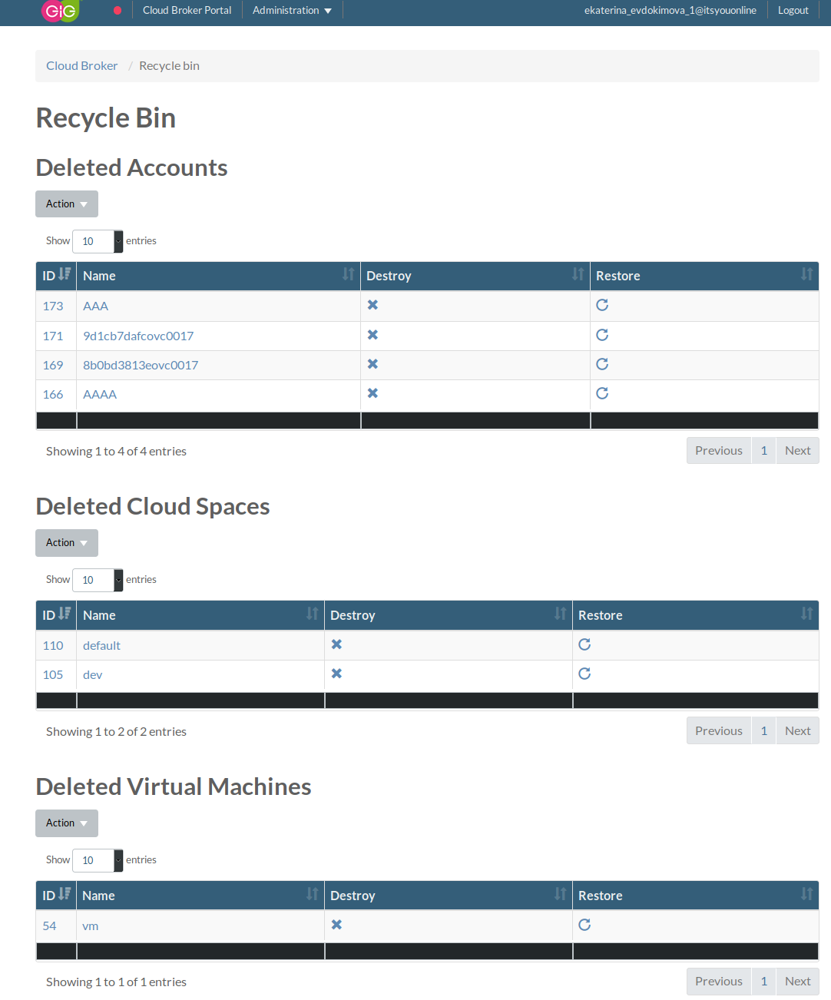
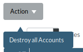
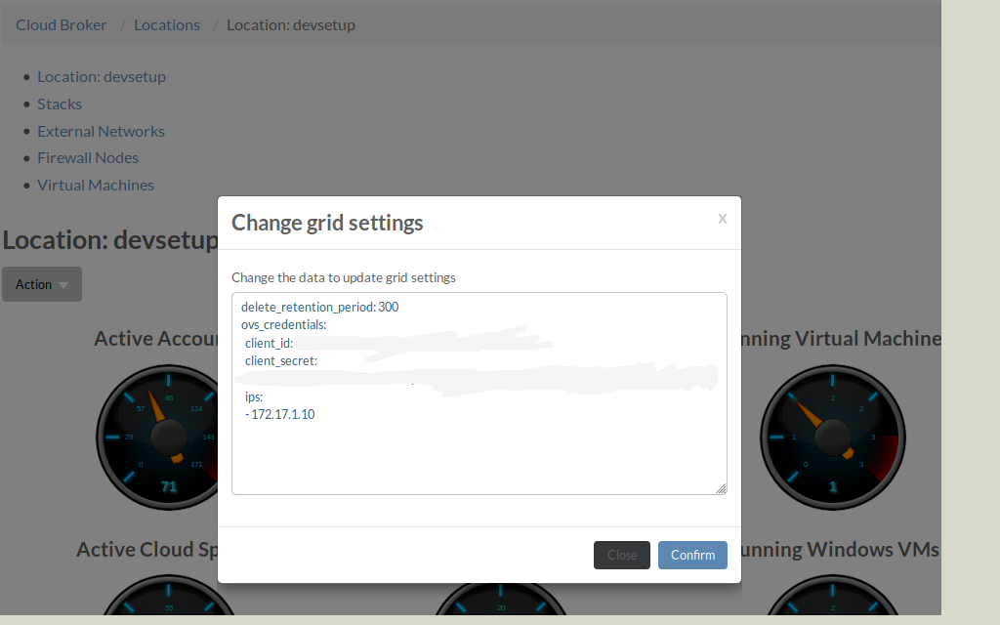

## Recycle Bin

Recycle Bin page lists all deleted accounts, cloudspaces, Virtual Machines (VMs), disks, images, and iso images unless deleted permanently. The Recycle Bin allows to recover objects within [`delete retention period`](#delete-retention-period), whereafter the objects are deleted permanently and cannot be restored.

For OVC objects that must have unique names, like accounts, cloudspaces on the same account, and VMs on the same cloudspace, names stay reserved while objects stay in recycle bin. Therefore, same names cannot be used to create new accounts, cloudspaces and VMs, until the original objects are permanently deleted.

### Actions

Action `destroy all ...` in each section of the Recycle Bin allows to clean up objects of corresponding type.

### delete retention period

Time that OVC objects stay in Recycle Bin before being deleted permanently is defined by `delete retention period`. See Cloudportal -> Locations -> location page -> Actions -> Change settings (time units: seconds).

