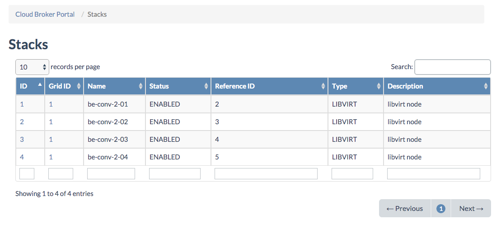
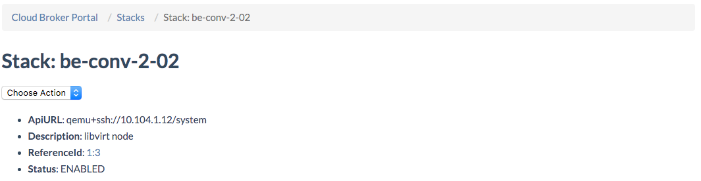
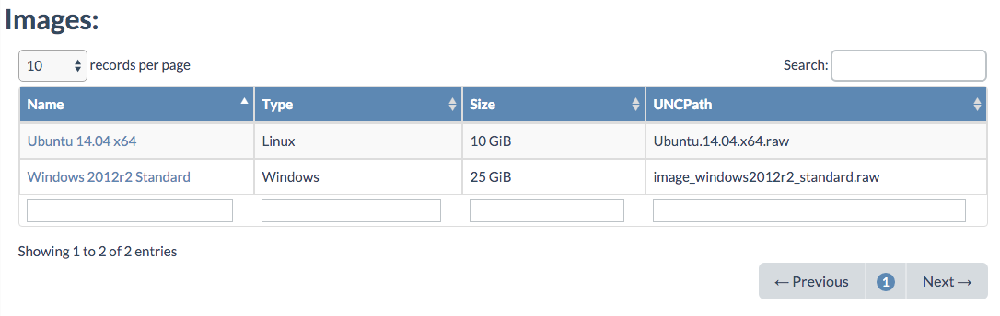
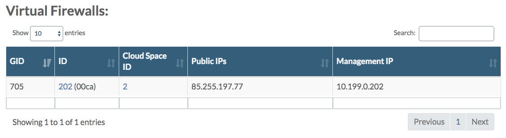
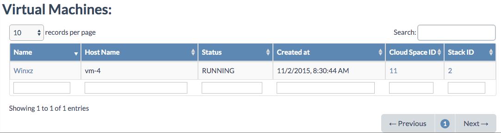

## Stacks

The **Stacks** page lists all compute nodes managed from your Cloud Broker Portal:

Clicking the **ID** brings you to the **Stack Details** page:

From the **Actions** dropdown menu you can:
- [Put the node in Maintenance Mode](/Sysadmin/Maintenance/putting_node_in_maintenance_mode.md)
- [Decommission the node](/Sysadmin/Decommission/decommission_node.md)

The **Status** of a node is one of the following:
- **Enabled**
- **Maintenance**
- **Decommissioned**
- **Error** with a hyperlink to an error condition

> **Note**: a node will only show to be in **Error** state as a result of a failing action or when a virtual machine deployment fails on that node, any other problem with the node, such as for example when the network got disconnected, will not change the status to **Error**. For the actual state of the node always check the [Status Overview](/GridPortal/StatusOverview/StatusOverview.md) page for that node in the **Grid Portal**, since the **Cloud Broker Portal** rather shows the desired state, not the actual condition (reality) as the  **Grid Portal** does!

Under **Images** all images available on that stack are listed:

From there you can navigate to the **Image Details** page for a specific image.

Next all virtual firewalls running on that compute node are listed:

Clicking the **ID** will navigate you to **Private Network Details** page, and clicking the **Cloud Space ID** links to the **Cloud Space Details** page.

Under **Virtual Machines** all virtual machines running on that compute node are listed:

By clicking on the name of the virtual machine you navigate to the **Virtual Machines Details** page.
