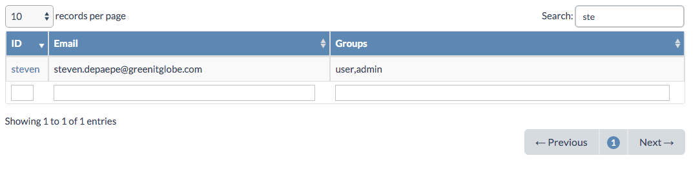
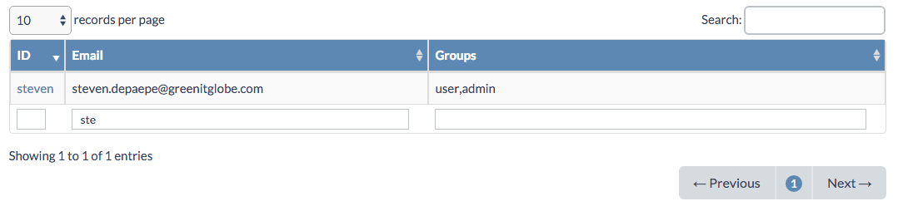
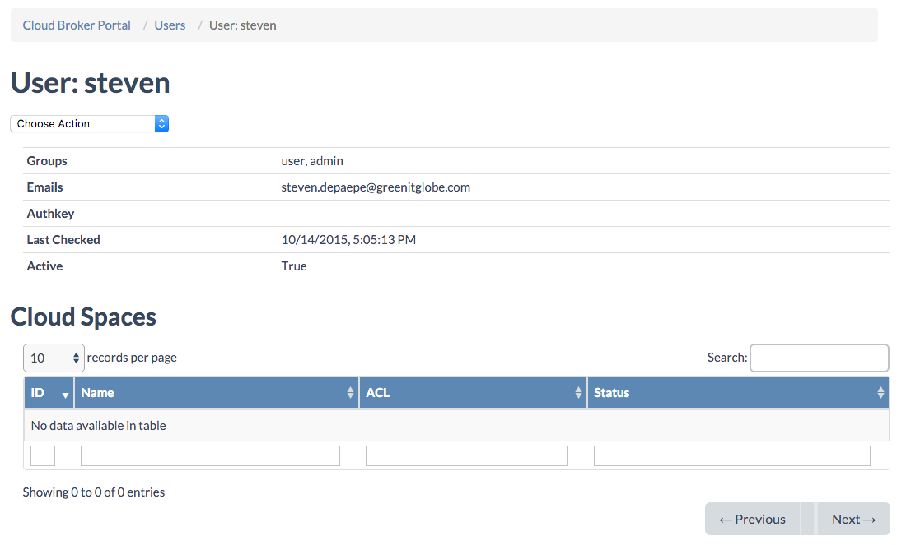

## Users

In order to have access the **Cloud Broker Portal**, the **User Portal**, or any portal created with **JumpScale Portal Framework**, you need a user.

User management is done in the **Users** page, which exists in the **System Portal** and in the **Cloud Broker Portal**:

 ![[]](Users.png)  

In the **Users** page you can:
- Add/create new users
- Update users

### Add/create Users

For adding a new user you simply choose **Add User** from the **Actions** dropdown menu:

![[]](CreateUser.png)

In order to create a user you need to specify:
- Username
- One or more comma separated email addresses
- Password
- Group membership

It is most common to be member of the "user" and/or the "admin" group:
- In order to have access to **End User** portal, you need at least "user" group membership
- Access to all other portals, such as the **Cloud Broker Portal**, requires at at least "admin" group membership

### Update Users

In order to update a user you click the user **ID** (username) of the user in the users table. This users table lists all the user in pages of 10 entries per page, which can be changed to 25, 50 or 100.

Instead of navigating through the user page you can also filter the list through the Search field at the top right of the user table, or the filter fields at the bottom of the columns:

 When you click the user **ID** (username) of the user you which to update, you will get to the **User Details** page:

 

 The **Action** dropdown menu on the **User Details** page allows you to:
 - Edit the user
 - Delete the user
 - Send a reset password link to the user

 As an administrator you will want to send a reset password email when the user forgot his password. The email will be send to the email address that you update via the edit user action.

 The **User Details** page also lists all cloud spaces to which the user has access.  
