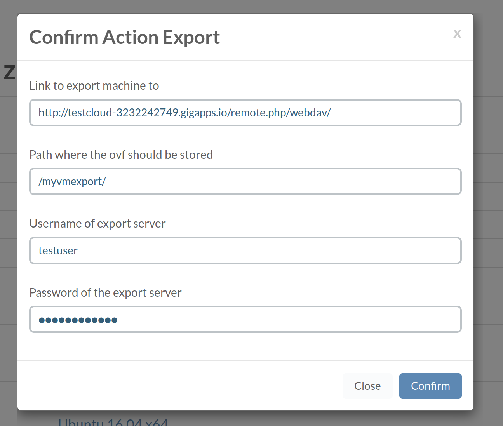

# Export VM

## Prerequisites

To be able to store the exported data of the VM we need access to a WebDAV server capable of storinge files of atleast 100MiB. This WebDAV server needs to be accessible from the OpenvCloud environment we are exporting the VMs.

## Parameters:

In the first first field we fill in the `HTTP(s)` address of our WebDAV server which optionally can include a path.  
In the second field we fill in a path (folder) in which the export data shold be save.  
In the third field we enter the username of the WebDAV server.  
In the fourth field we enter the password of the WebDAV server.  

You VM export will be scheduled. You can follow up on it by checking /grid/jobs and filtering on export

When VM export is succcessfully finished it you will find your directory has been populated with chunks of 100MiB files and a README file.

To import it again see [Import Machine](../../CloudSpaces/CloudSpaces.md)
