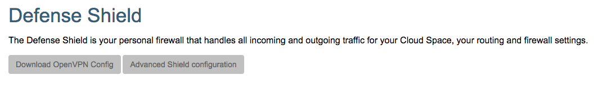

## Defense Shield

Each virtual datacenter (cloud space) get its own virtual private network, that is protect by the **Defense Shield**.

In the **End User Portal** we try to keep as simple as possible, by only exposing the the most important and relevant features to the end user.

Consequently most of the **Defense Shield** configuration options are hidden, as you can see on the **Defense Shield** page:

By clicking the **Advanced Shield configuration** button you get access to all configation options of the virtual private network:

