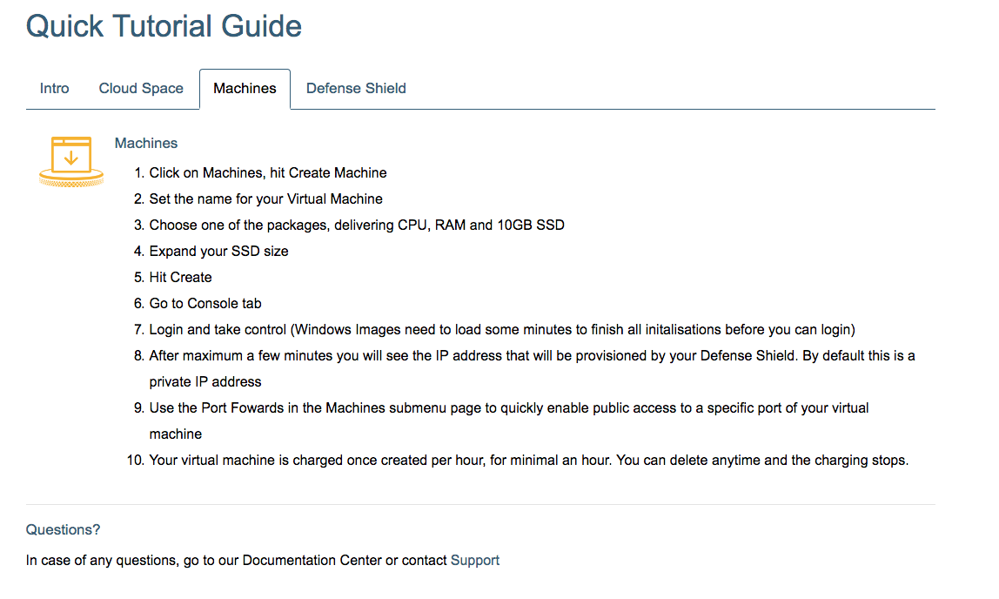

## Getting Started

The **Getting Started** page can be accessed through the top navigation menu.

It provides access to a **Quick Tutorial Guide**:

The content of the **Getting Started** page can be adapted in the `apps/ms1_fe/base/wiki_gcb/Portal/Support/Getting Started/` directory of the environment repository on the master cloud space. See the [How to Connect to an Environment](../../Sysadmin/connect.md) documentation for more information about the master cloud space, and how to access it.