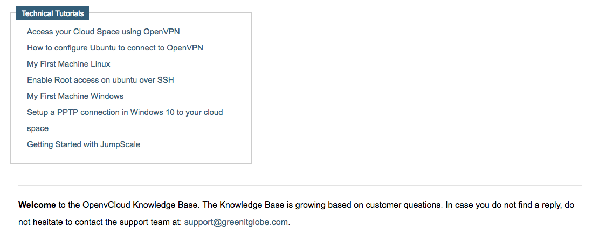

## Knowledge Base

The **Knowledge Base** can be accessed through the top menu bar.

By default it contains a set of **Technical Tutorials**:

The content of the **Knowledge Base** can be adapted in the `apps/ms1_fe/base/wiki_gcb/Portal/Docs` directory of the environment repository on the master cloud space. See the [How to Connect to an Environment](../../Sysadmin/connect.md) documentation for more information about the master cloud space, and how to access it.