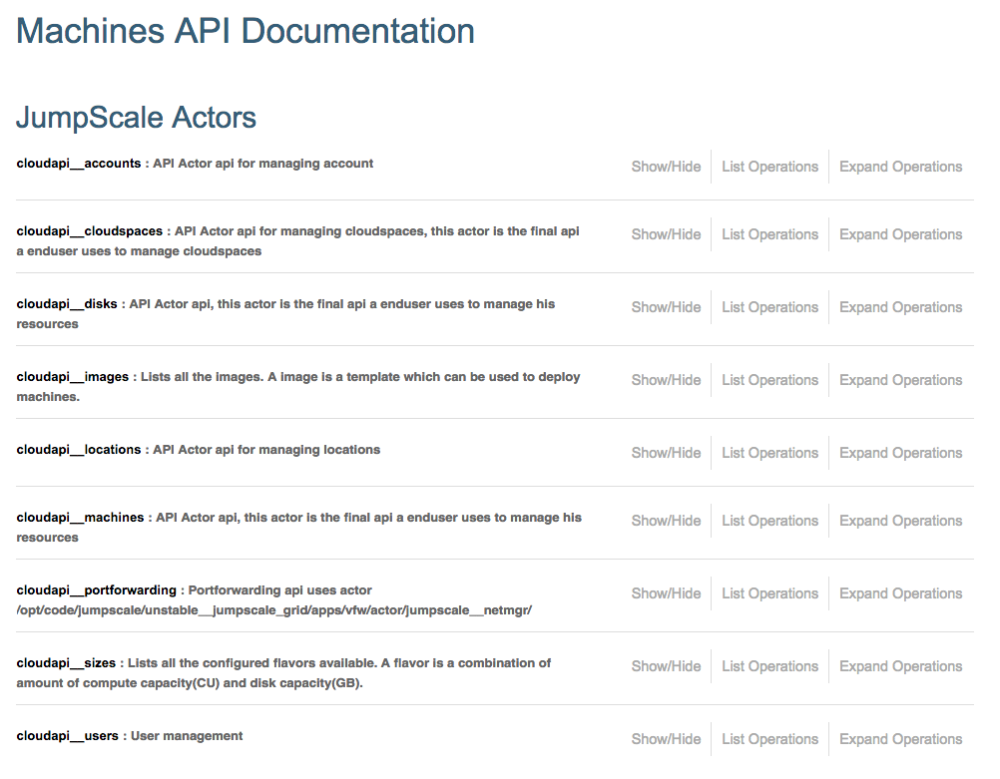
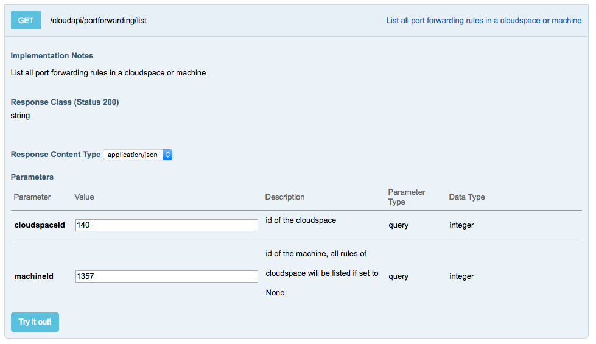
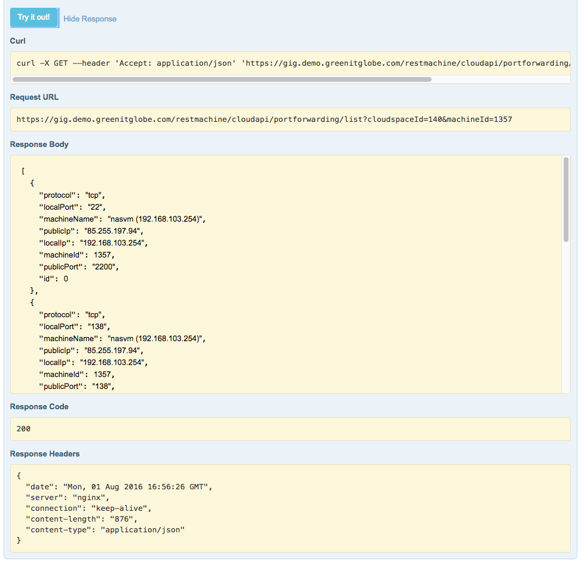

## Machine API

The **Machine API** can be accessed through the top navigation menu:

This page is both documenting the various REST APIs, and allowing you to test them.

All OpenvCloud Portal pages are build on top of these APIs, as exposed by the JumpScale application services.

The APIs are grouped as follows:

- accounts
- cloudspaces
- disks
- images
- locations
- machines
- portforwardings
- sizes 
- users

Below an example of using the portforwarding/list API for virtual machine with ID '1357' as part of cloud space (virtual datacenter) with ID '140':

When click **Try it out!** you see the below result:

