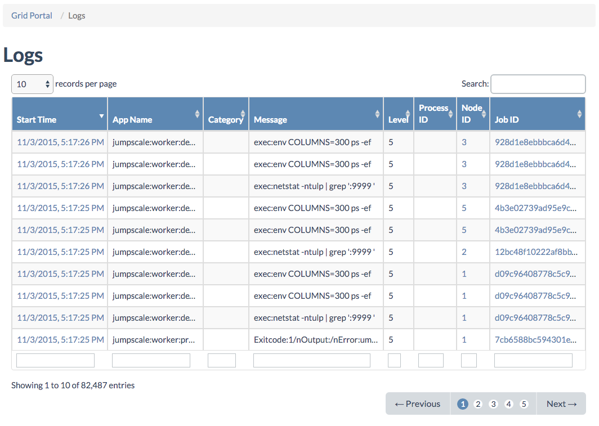

## Logs

All **OpenvCloud** components are instrumented, writing useful information to logs:

All columns have filters, and for **Start Time** and **Level** you can specify a range:

Clicking the **Start Time** timestamp brings you to the **Log Details** page:

![[]](LogDetails.png)
