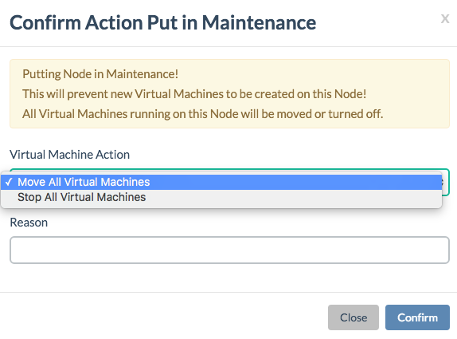

## Adding & Removing CPU Nodes

### Adding a CPU Node

- **Step 1**: Add the node to the [system-config.yaml](../../Installation/System-config.md).
- **Step 2**: [Update the configuration into kubernetes using the installer script](../../Installation/Installer-script.md#cluster-writeconfig).
- **Step 3**: [Install the node using the installer script](../../Installation/Installer-script.md#cluster-writeconfig#node)

### Removing a CPU node

Steps in order to replace a CPU node:

- **Step 1**: Put the node in Maintenance mode
  - Documented in the [section about putting a node in Maintenance mode](../../Sysadmin/Maintenance/putting_node_in_maintenance_mode.md)
  - Make sure to select the **Move All Virtual Machines** option:

    

  - Wait until the node is in Maintenance mode, and that all virtual machines have moved to another node

- **Step 2**: Shutdown the node
- **Step 3**: Put the node in Decommission mode, documented [here](../../Sysadmin/Decommission/decommission_node.md)
- **Step 4**: Remove the node from [system-config.yaml](../../Installation/System-config.md).
- **Step 5**: [Update the configuration into kubernetes using the installer script](../../Installation/Installer-script.md#cluster-writeconfig).