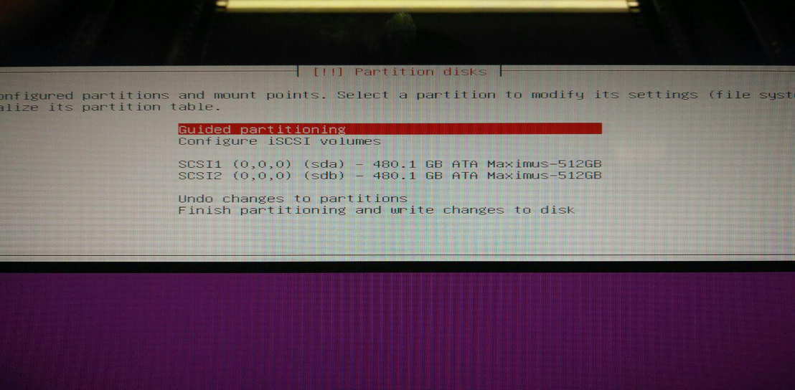
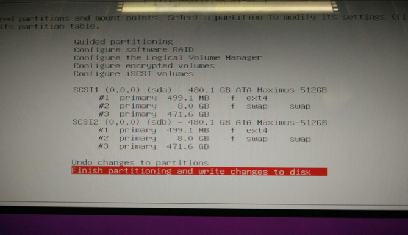
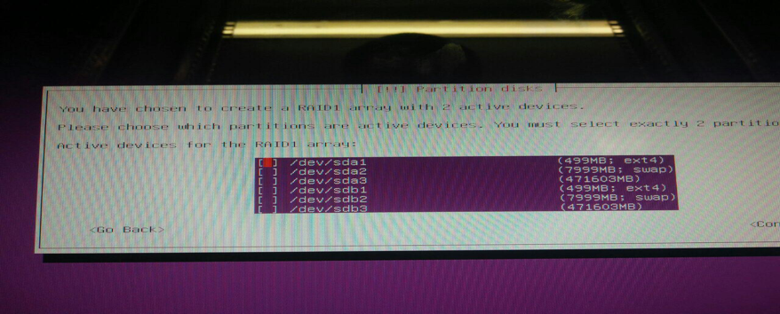
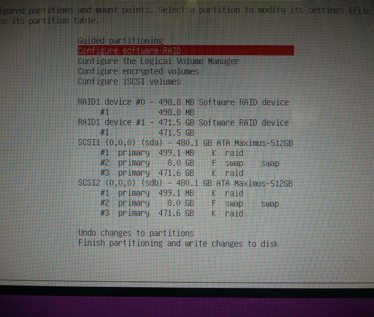

## Setup of the Controllers

An OpenvCloud environment has 3 controllers, which are actually three physical server nodes, mounted in the same G8 rack of the compute nodes and storage nodes. For a functional installation only one of the three controllers is needed. Below steps document how to setup one controller.

Setting up an environment with one controller is done in following steps:
- [Step 1: Install the OS](#install-OS)
- [Step 2: Install git](#install-git)
- [Step 3: Install Open vSwitch](#install-openvswitch)
- [Step 4: Configure Open vSwitch](#configure-openvswitch)
- [Step 5: Install Docker](#install-docker)

<a id="install-OS"></a>
#### Step 2: Install OS (step 1)

1. Create a bootable USB Drive containing the [Ubuntu 16.04.1 Server (AMD64)](http://mirrors.easynews.com/linux/ubuntu-releases/16.04.1/ubuntu-16.04.1-server-amd64.iso); On Windows, you might want to use the tool [Rufus](https://rufus.akeo.ie/).
2. Make sure a monitor and keyboard are connected to the Controller
3. Plug in the USB drive
4. Boot the Controller
5. During startup the GOOXI logo will show up, press **F7** in the Boot Device Popup
6. Select the **USB Flash Disk**
7. Select **English** language
8. Select **Install Ubuntu Server**
9. Select **English** language again
10. Select **United States** location
11. **Do not detect keyboard layout**
12. Select appropriate keyboard layout (and possibly variant)
13. Select the primary NIC
14. If network config failed: **Select Do Not Configure The Network At This Time**
15. Enter the correct hostname (i.e. US-G8-2-CTR-01)
16. When asked to enter a **username** use **gig**
17. When asked for a **password** use **rooter**
18. Confirm the **use of a weak password**
19. **Encrypt home directory**: **No**
20. Select the correct time zone
21. Choose **Manual** when asked for the **Partitioning Method**
22. You will see this screen:

    

> If there is already a config or partitioning present you will need to remove it first

23. Select `sda` and press Enter
24. When asked to create a partitioning table, select **Yes**
25. Select the *FREE SPACE* line below the `sda` disk
26. Select **Create a New Partition**
27. Enter **5 GB**
28. Select **Primary**
29. Select **Beginning**
30. Select **Mount point** and change to **Do No Mount**
31. Select **Done Setting Up The Partition**
32. Select the *FREE SPACE* line below the `sda` disk again
33. Select **Create a New Partition**
34. Enter **8 GB**
35. Select **Primary**
36. Select **Beginning**
37. Select **Use As** and change to **Swap Area**
38. Select **Done Setting Up The Partition**
39. Select the *FREE SPACE* line below the 'sda' disk yet again
40. Select **Create a New Partition**
41. Don’t change disk size value already entered (should be all remaining space on disk)
42. Select **Primary**
43. Select **Use As** and change to **Do Not Use**
44. Select **Done Setting Up The Partition**
45. Create the exact same 3 partitions on the 'sdb' disk
    - See previous steps for exact parameters
46. Screen should look like this:

    

47. Select **Configure software RAID**
48. When asked to **Write The Changes To The Storage Devices And Configure RAID** choose **Yes**
49. Select **Create MD Device**
50. Select **RAID1**
51. Enter **Number Of Active Devices**: **2**
52. Enter **Number Of Spare Devices**: **0**
53. You will see this screen:

    

54. Select `sda1` and `sdb1` using the **Space** bar and press **Enter** to confirm
55. Select **Yes** when asked to **Write The Changes**
56. Select **Create MD Device** again
57. Select **RAID1**
58. Enter **Number Of Active Devices**: **2**
59. Enter **Number Of Spare Devices**: **0**
60. Select 'sda3' and 'sdb3' using the **Space** bar and press **Enter** to confirm
61. Select **Yes** when asked to **Write The Changes**
62. Select **Finish**
63. You will see this screen:

    

64. Select the **#1** option below RAID1 device #0 (size: 5.0 GB)
65. Select **Use As** and change to **BTRFS**
66. Select **Mount point** and change to **/boot**
67. Select **Done Setting Up The Partition**
68. Select the **#1** option below RAID1 device #1 (size: 499.0 GB)
69. Select **Use As** and change to **BTRFS**
70. Select **Mount** point and change to */*
71. Select **Done Setting Up The Partition**
72. Select **Finish Up Partitioning And Write The Changes To Disk**
73. Select **Yes to Write The Changes To Disk**
74. Wait while the actual installation takes place
75. When asked how to manage updates on this system select **No Automatic Updates**
76. When asked which software to install: select **OpenSSH Server (keep standard system utilities selected)** with the **Space** bar and press **Enter** to confirm
77. On the **Installation Complete** dialog: disconnect the USB Drive and select **Continue to reboot the system**

Congratulations, you may or may not have just accidentally installed Linux...

<a id="install-git"></a>
#### Step 2: Install git (step 2)

```
apt-get install git
```

<a id="install-openvswitch"></a>
#### Install Open vSwitch (step 3)

```
apt-get install openvswitch-switch
```

<a id="configure-openvswitch"></a>
#### Configure Open vSwitch (step 4)

> **Caution**:
> If you're on the controller over ssh, be aware that the below will actually reconfiguring the network, which can cut you off

Create `backplane1`:

```bash
ovs-vsctl add-br backplane1
dev=`ip -o r | awk '/default/{print $5}'`
ip=`ip -o -4 a ls dev $dev | awk '{print $4}'`
ovs-vsctl add-port backplane1 $dev
ip a d $ip dev $dev
ip a a $ip dev backplane1
sysctl -w net.ipv6.conf.${dev}.disable_ipv6=1
#note: this is a live setup, you'll need to adapt /etc/network/interfaces
```

Set your primary interface to manual, by changing `/etc/network/interfaces` as follows:

```
# This file describes the network interfaces available on your system
# and how to activate them. For more information, see interfaces(5).

source /etc/network/interfaces.d/*

# The loopback network interface
auto lo
iface lo inet loopback

# The primary network interface
auto eno1
iface eno1 inet manual
```

Create `/etc/network/interfaces.d/backplane1`:

```
iface backplane1 inet static
  address 192.168.0.250
  netmask 255.255.255.0
  gateway 192.168.0.1
  dns-nameserver 192.168.0.1
  pre-up ifup eno1
  post-up ip l set eno1 up
  post-up sysctl -w net.ipv6.conf.eno1.disable_ipv6=1
auto backplane1
```

Reboot the Controller to verify that network connectivity still is ok.

<a id="install-docker"></a>
#### Install Docker (step 5)

See the official [Install Docker on Ubuntu](https://docs.docker.com/engine/installation/linux/ubuntulinux/) documentation.
