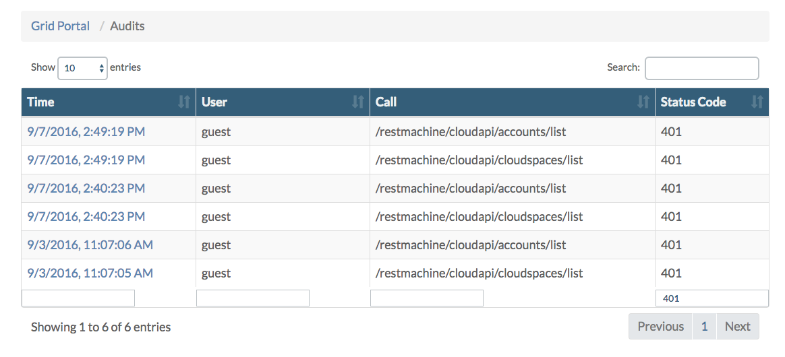

## Review Audit Logs for Security Alerts

In the **Grid Portal** you will find the **Audits** page, which is documented [here](../../GridPortal/Audits/Audits.md).

On the **Audits** page you will find records for all API calls that require user authentication. For instance if a user logs in to the **End User Portal** 5 new audit records are created, one for each of the following REST API calls:

- /restmachine/cloudapi/accounts/list
- /restmachine/cloudapi/locations/list
- /restmachine/cloudapi/users/get
- /restmachine/cloudapi/cloudspaces/list
- /restmachine/cloudapi/cloudspaces/get

Audits records are of course also created when somebody fails to login successfully, or uses one of the REST APIs with wrong credentials, see below the for instance for all audits filtered in **Status Code** 401:

