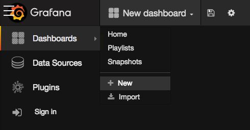
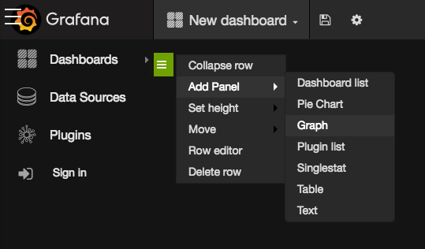
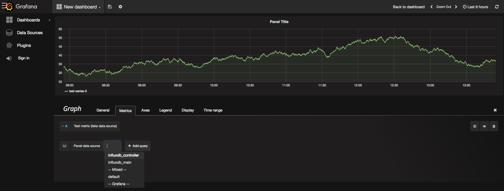
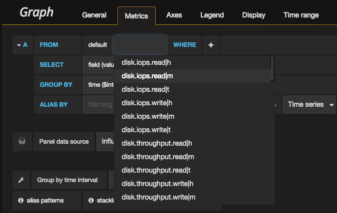
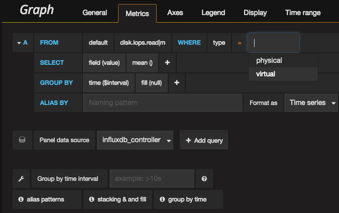
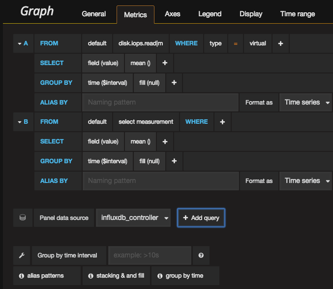
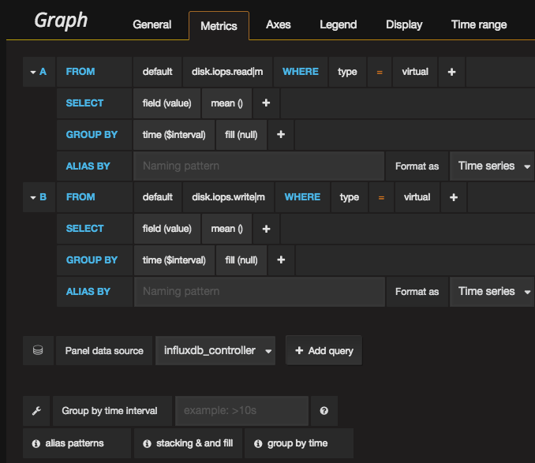
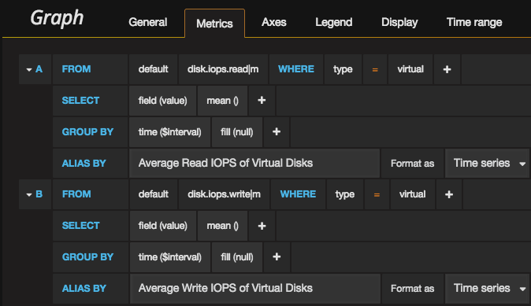
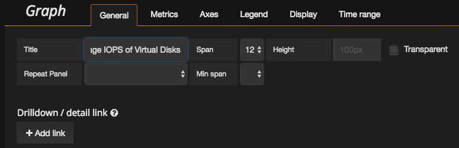
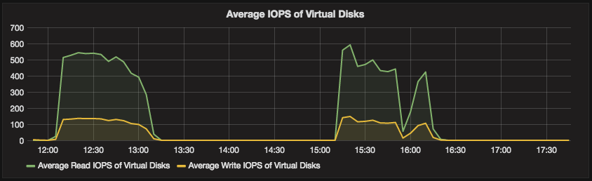

## Create Custom Dashboards

If you are completely new to Grafana, start here: http://docs.grafana.org/guides/gettingstarted/

Following measurements are available:
- disk.iops.read
- disk.iops.write
- disk.throughput.read
- disk.throughput.write
- machine.CPU.utilisation
- network.packages.rx
- network.packages.tx
- network.throughput.incoming
- network.throughput.outgoing
- network.vfw.packets.rx
- network.vfw.packets.tx
- network.vfw.throughput.incoming
- network.vfw.throughput.outgoing

For each of them three variants exist:
- h: values collected per hour
- m: values collected per 5 minutes
- t: total aggregated value 

In what follows all steps are documented in order to create a simple dashboard visualizing the average read and write IOPS of all virtual machines.

The very first step is selecting **+ New** from the **Dashboard** menu:

You'll get an empty dashboard, with one row.

From the hamburger menu on the left of the row select **Add Panel > Graph**:

On **Metrics** tab of the Graph panel select **Influxdb_controller** as the value for **Panel data source**:

Still in the **Metrics** tab select **disk.iops.read** as the measurement of the first query:

Next specify that you only want the values of the virtual disks:

Add a second query by clicking **+ Add query**:

For the second query select **disk.iops.write** as the measurement, and again for the virtual disks:

Change the aliases of both queries:

In the **General** tab change the **Title** to **Average IOPS of Virtual Disks**:

Hit **Save** and see the result:

