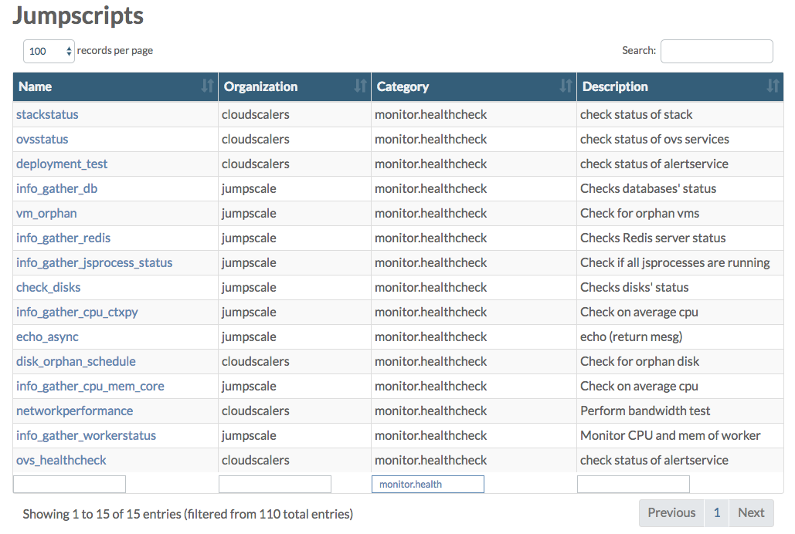
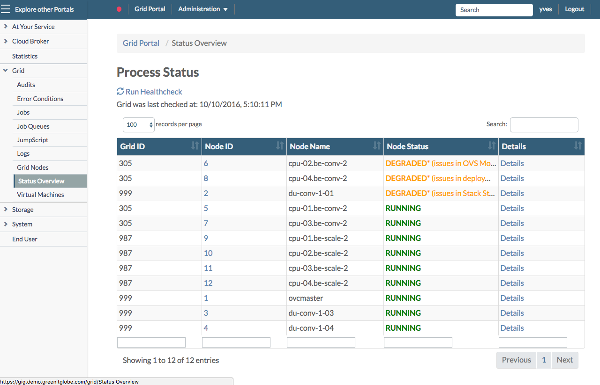

## Monitor the System Health

The system health is monitored using a collection of JumpScripts, maintained in a private [0-complexity/selfhealing](https://github.com/0-complexity/selfhealing) GitHub repository. Check this private repository in order to get a current view on all JumpScripts. Below is just a snapshot in time.

Also check the **JumpScript** page in the **Grid Portal** where you can filter on **monitor.health** to see a list of the JumpScripts actually available on your environment:

  

In order to check the actual system health go to the **Status Overview** page in the **Grid Portal**, also reachable by clicking the green, orange or red colored bullet in the top navigation bar:

For more information about the **Status Overview** page go to the dedicated section [here](../../GridPortal/StatusOverview/StatusOverview.md).

In what follows you get overview of all JumpScripts, organized in the same way (sections) as on the **Node Status** page.

Depending on the type of node, following sections are available:

| Section                       | Master Node | CPU Node | Storage Node |
|:------------------------------|:-----------:|:--------:|:------------:|
|[AYS Process](#ays-process)    | X           | X        | X            |
|[Databases](#databases)        | X           |          |              |
|[Disks](#disks)                | X           | X        | X            |
|[JSAgent](#jsagent)            | X           | X        | X            |
|[Network](#network)            | X           |          |              |
|[Orphanage](#orphanage)        | X           | X        |              |
|[Redis](#redis)                | X           | X        | X            |
|[System Load](#system-load)    | X           | X        | X            |
|[Temperature](#temperature)    | X           | X        | X            |
|[Workers](#workers)            | X           | X        | X            |
|[Hardware](#hardware)          |             | X        | X            |
|[Node Status](#node)           |             | X        | X            |
|[Deployment Test](#deployment) |             | X        |              |
|[OVS Services](#ovs-services)  |             |          | X            |

### AYS Process
- **ays_process_check.py** checks if all AYS processes are running. Throws an error condition for each process that is not running

### System Load
- **cpu_ctxpy_check.py** checks the number of CPU context switches per second. If higher than expected an error condition is thrown
- **cpu_interrupts_check.py** checks the number of interrupts per second. If higher than expected an error condition is thrown
- **cpu_mem_core_check.py** checks memory and CPU usage/load. If average per hour is higher than expected an error condition is thrown
- **openfd_check.py** checks the number of open file descriptors for each process
- **swap_used_check.py** checks the amount of swap used by the system
- **threads_check.py** checks the number of threads, and throw an error if higher than expected

### Databases
- **db_check.py** checks status of MongoDB and InfluxDB databases on Master. If not running an error condition is thrown.

### Orphanage
- **disk_orphan.py** checks for orphan disks on volume driver nodes. Generates warning if orphan disks exist on the specified volumes. Is scheduled by **disk_orphan_schedule.py**, running on the master. Throws an error condition for each orphan disk found
- **vm_orphan.py** checks if libvirt still has VMs that are not known by the system

### Disks
- **disk_usage_check.py** checks status of all physical disks and partitions on all nodes, reporting back the free disk space on mount points. Throws error condition for each disk that is almost (>90%) full

### Hardware
- **fan_check.py** checks the fans of a node using IPMItool
- **networkbond_check.py** monitors if a network bond (if there is one) has both (or more) interfaces properly active
- **psu_check.py** checks the power redundancy of a node using IPMItool
- **raid_check.py** checks whether all configured RAID devices are still healthy

### Bandwidth Test
- **networkperformance.py** tests bandwidth between storage nodes, volume drivers and itself

### OpenvStorage
- **ovs_healthcheck.py** calls the standard Open vStorage health checks, see: https://github.com/openvstorage/openvstorage-health-check

### OVS Services
- **ovsstatus.py** checks every predefined period (default 60 seconds) if all OVS processes are still run

### Deployment Test
- **deployment_test.py** tests every predefined period (default 30 minutes) whether test VM exists and if exists it tests write speed. Every 24hrs, test VM is recreated

### Network
- **publicipswatcher.py** checks the status of the available public IPs
- **routeros_check.py** checks the status of RouterOS. (scheduled by **routeros_check_schedule.py**)

### Redis
- **redis_usage_check.py** checks Redis server status

### Stack Status
- **nodestatus.py** checks the status of each stack (CPU node)

### Temperature
- **temp_check.py** checks the CPU + disk temperature of the system

### Workers
- **workerstatus_check.py** monitors the workers, checking if they report back on regular basis report to their agent for new tasks
