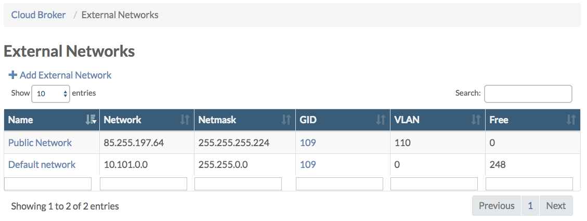
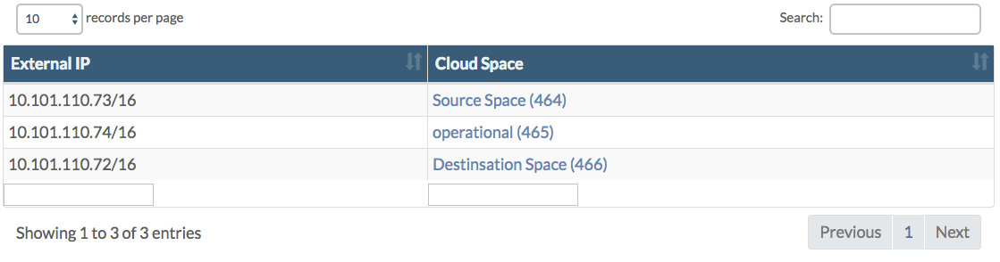

## Monitor Used External Network Addresses

In the **Cloud Broker Portal** on the **External Networks** page you get an overview of the number of available ("free") IP addresses per external network:

From there you can click through to the **External Network Details** page:

  

Under the section **Free IPs** all free IP addresses are listed:

Next all **cloud spaces** are listed that use one of the external network IP addresses:

Also all **virtual machines** are listed that have been connected directly to one of the external network IP address.

See the [External Networks](../../CloudBrokerPortal/PublicNetworks/PublicNetworks.png) for more details.
