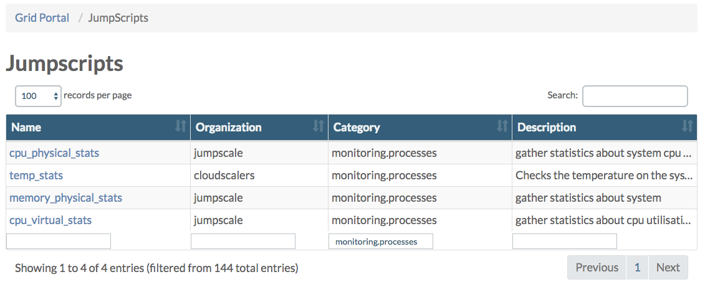

## How statistics are gathered

On all physical nodes statistics are gathered and aggregated through Redis.

On the controller of the environment the aggregated data is saved in InfluxDB, from where the statistics can be visualized in the OpenvCloud Operator Portal.

The gathering is done using a collection of JumpScripts, maintained in a private [0-complexity/selfhealing](https://github.com/0-complexity/selfhealing) GitHub repository. Check this private repository in order to get a current view on all JumpScripts. Below is just a snapshot in time.

Also check the **JumpScript** page in the **Grid Portal** where you can filter on **monitoring.processes** to see a list of the JumpScripts actually available on your environment:

  

### Script that run on both the CPU nodes and the storage nodes
- **cpu_physical_stats.py** gathers CPU statistics (CPU time, CPU percent, number of threads, number of context switches, number of interrupts) from physical machines and saves them to Redis
- **disk_physical_stats.py** gathers statistics about the physical disks
- **memory_physical_stats.py** gathers statistics about the memory of the physical machines
- **network_physical_stats.py** gathers following network statistics from the physical machines:
  - network.throughput.outgoing
  - network.throughput.incoming
  - network.packets.tx
  - network.packets.rx
- **temp_stats.py** checks the (CPU/disk) temperature of the system

### Scripts that run only on the CPU nodes
- **cpu_virtual_stats.py** gathers statistics about CPU utilization on the virtual machines
- **disk_virtual_stats.py** gathers statistics (iops.read, iops.write, throughput.read, throughput.write) about virtual disks
- **network_virtual_stats.py** gathers following network statistics from the virtual machines:
  - network.throughput.outgoing
  - network.throughput.incoming
  - network.packets.tx
  - network.packets.rx

### Scripts that run only on the storage nodes
- **ovs_asd.py**
- **ovs_backend.py** gathers statistics about the Open vStorage backends
- **ovs_disk_safety.py** gathers statistics about disk safety and sends this disk safety statistics for each vpool and the amount of namespaces with the lowest disk safety to the database
- **ovs_proxyperf.py** gathers statistics about Open vStorage proxy performance
- **ovs_vdisks.py** gathers statistics about the vDisks
- **ovs_vpool.py** gathers statistics about the vPools

### Other scripts

Next to the above scripts, also following scripts exist:
- **machine_monitoring.py** gathers statistics about all virtual machines, visualized in the Grid Portal.
- **network_gathering.py** gathers information about the NICs, visualized in the Grid Portal: Grid Node > NICS > NIC Details page.

Also see the health check scripts, discussed in the [System Health](../Health/Health.md) section.
