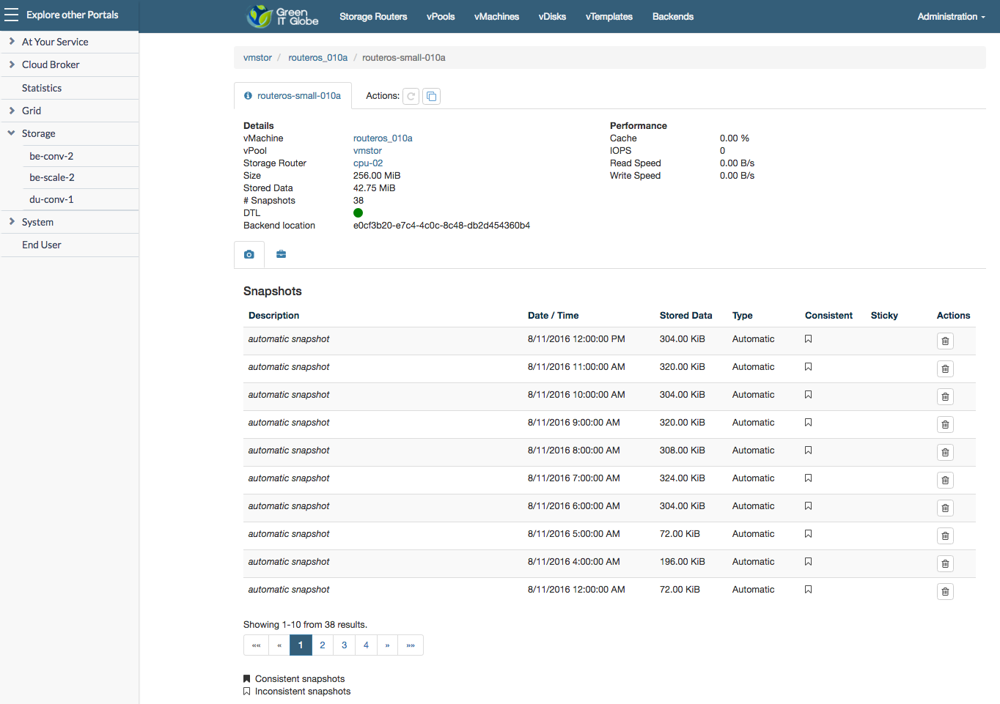

## Monitor Storage Utilization

In the **Operator Portal** you can check the amount of stored data on a vDisk by selecting the location under **Storage** and then navigate to a vDisk:

This amount includes both the stored data and snapshot data.
