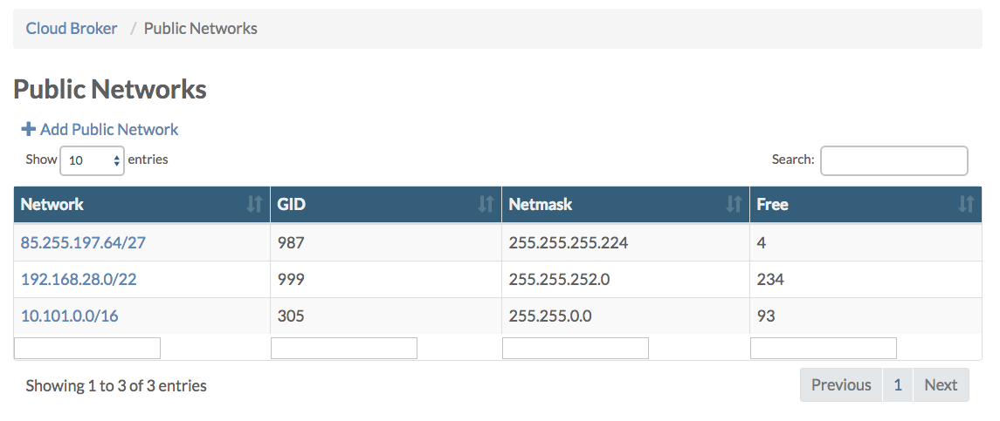
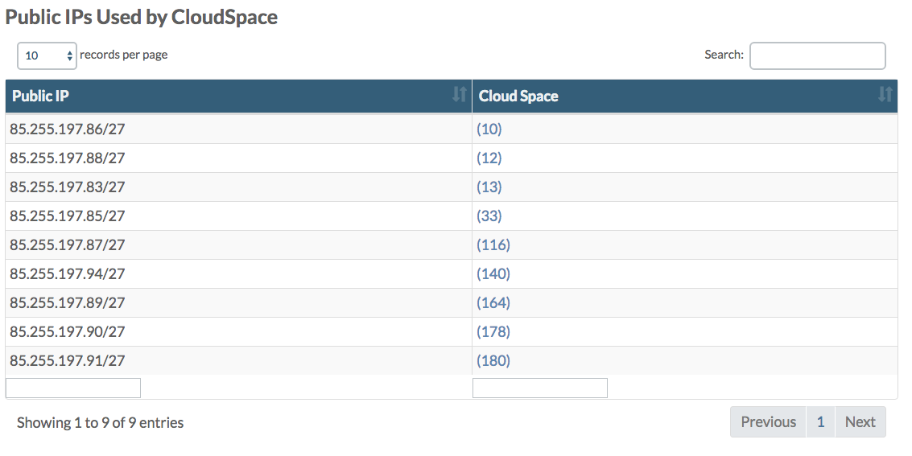

## Monitor Current Utilization

### Grafana Dashboards

See [Statistics](../Statistics/Statistics.md).

### Storage Utilization

In the **Operator Portal** you can check the amount of stored date on a vDisk by selecting the location under **Storage** and then navigate to a vDisk:

This amount includes both the stored data and snapshot data.

### Compute Utilization

@todo

### Public IP Addresses

In the **Cloud Broker Portal** on the **Public Networks** page you'll get an overview of the number of available ("free") public IP addresses per private location:

From there you can click through to the **Public Network Details** page in order to see which cloud spaces and virtual machines use the public IP addresses:

  

See the [section about Public Network](../CloudBrokerPortal/PublicNetworks/PublicNetworks.png) for more details.

### Cloud Units

Also see the [section about Cloud Units](cloudunits.md).
