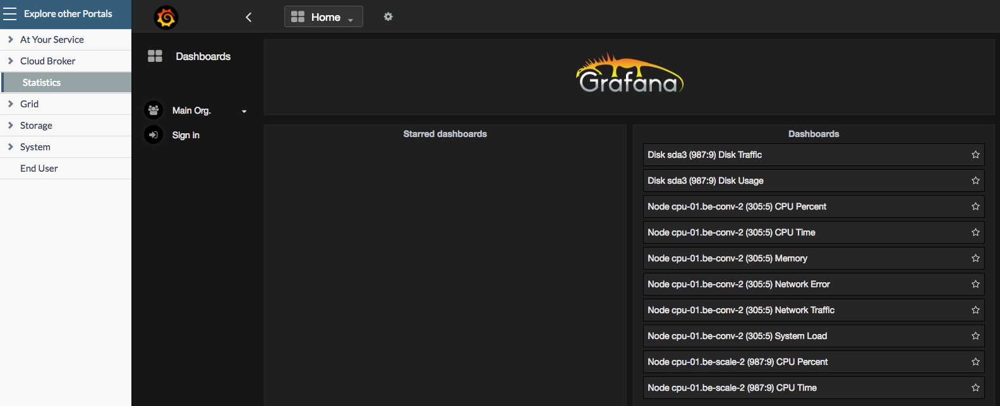
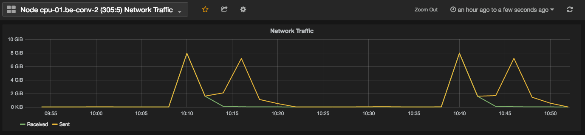
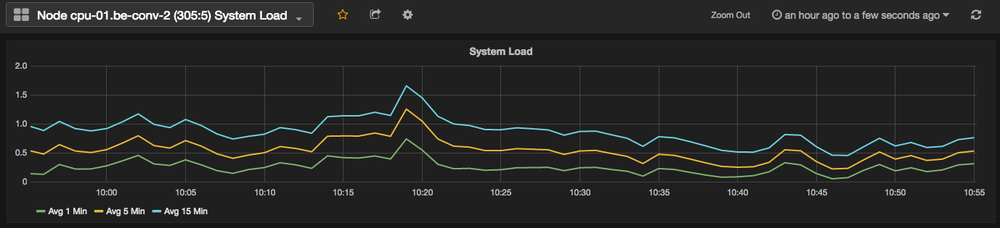

## Monitor Current Utilization

### Grafana Dashboards

OpenvCloud integrates with [Grafana](http://grafana.org/) for data visualization, and uses [InfluxDB](http://docs.grafana.org/datasources/influxdb/) as for agregating all utilization data.

The **Grafana Dashboards** are available in the **Operator Portal** under **Statistics**:

Here you can create dashboards for visualizing per CPU node :

- CPU percent and time
- Memory
- Network errors and traffic

  

- System Load

  

### Storage Utilization

In the **Operator Portal** you can check the amount of stored date on a vDisk by selecting the location under **Storage** and then navigte to a vDisk:

This amount includes botht the stored data and snapshot data.

### Compute Utilization

@todo

### Public IP Addresses 

In the **Cloud Broker Portal** on the **Public Networks** page you'll get an overview of the number of available ("free") public IP addresses per private location: 

From there you can click through to the **Public Network Details** page in order to see which cloudspaces and virtual machines use the public IP addresses:

  

See the [section about Public Network](../CloudBrokerPortal/PublicNetworks/PublicNetworks.png) for more details.

### Cloud Units

Also see the [section about Cloud Units](cloudunits.md).