## Statistics

OpenvCloud integrates with [Grafana](http://grafana.org/) for data visualization, and uses [InfluxDB](http://docs.grafana.org/datasources/influxdb/) for storing all aggregated data gathered through **Redis** from various sources. See [How statistics are gathered](../Monitoring/Statistics/Statistics.md) for more details.

Actual visualization is done via **Grafana Dashboards** which are available in the **Operator Portal** under **Statistics**:

### Overall System Performance

The **Cloud Broker Operator Portal** comes out of the box with the **Overall System Performance** dashboard consisting of following panels:
- [Total IOPS](#total-iops)
- [CPU utilization](#cpu-utilization)
- [CPU percentage](#cpu-percentage)
- [Available memory](#available-memory)
- [Context Switches](#context-switches)
- [Rx/Tx](#rx-tx)

#### Total IOPS

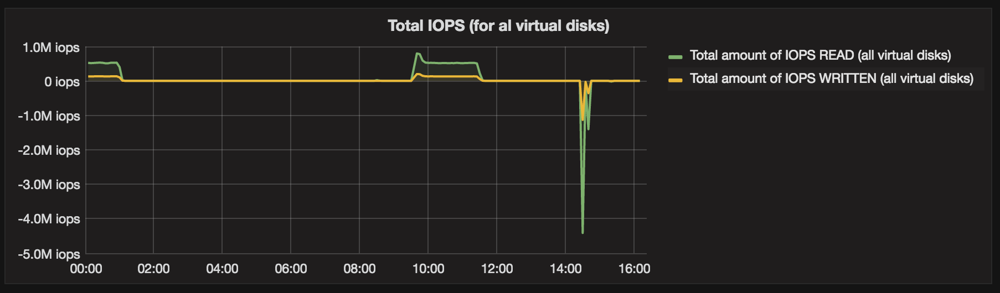

#### CPU utilization

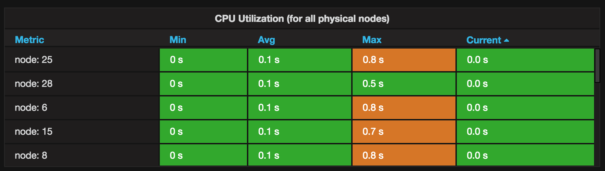

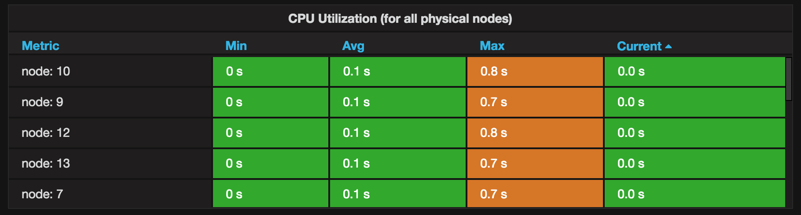

#### CPU percentage

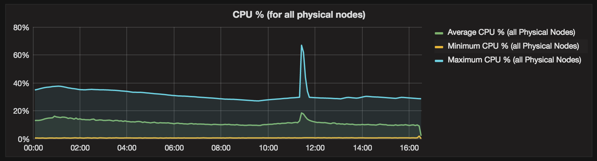

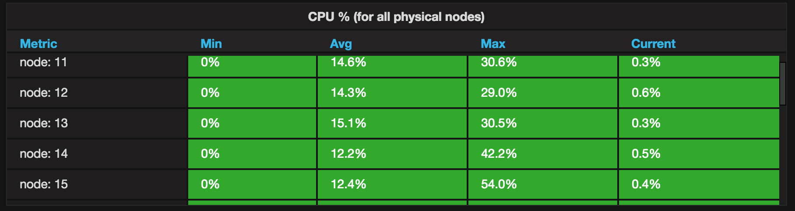

#### Available memory

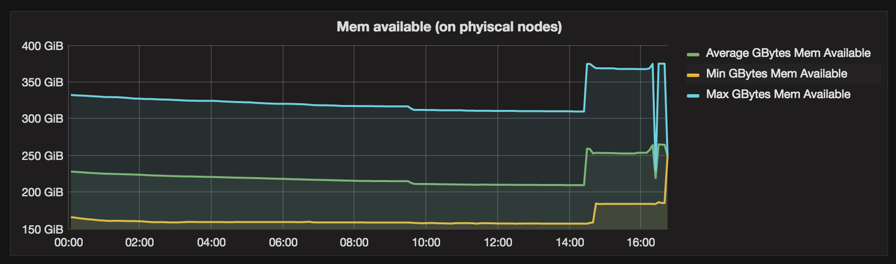

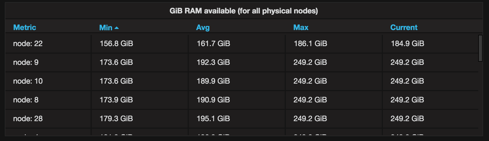

#### Context Switches

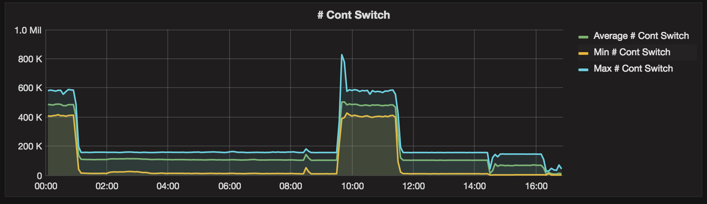
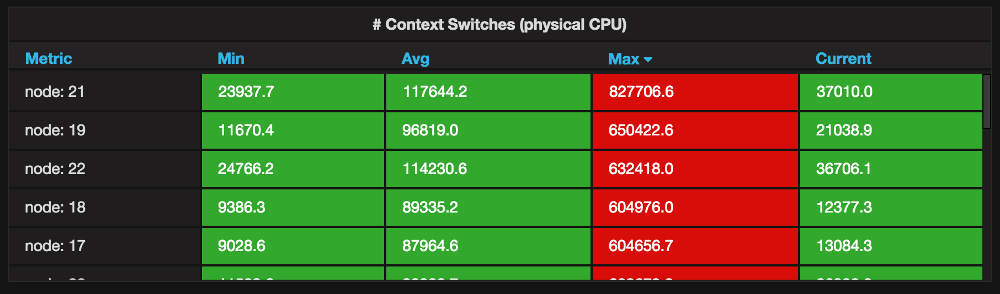

#### Rx/Tx

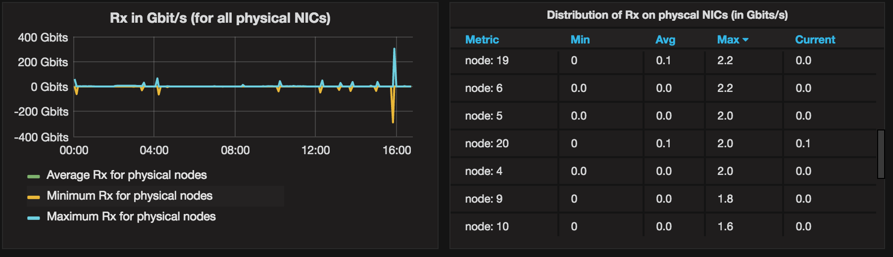
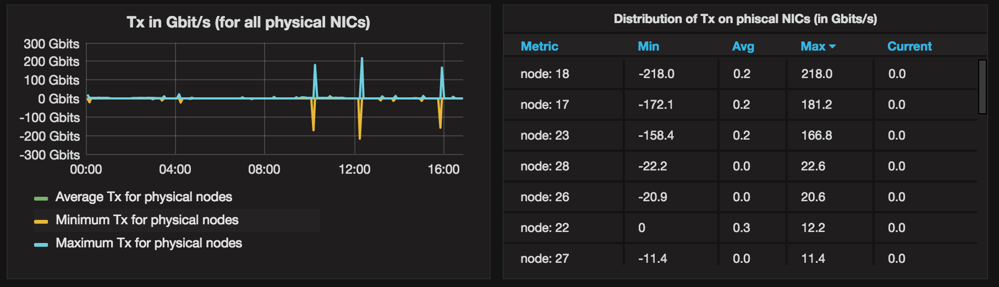
