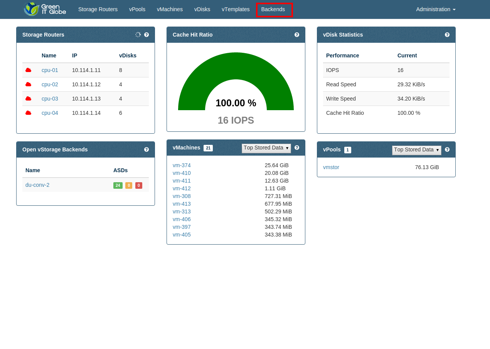
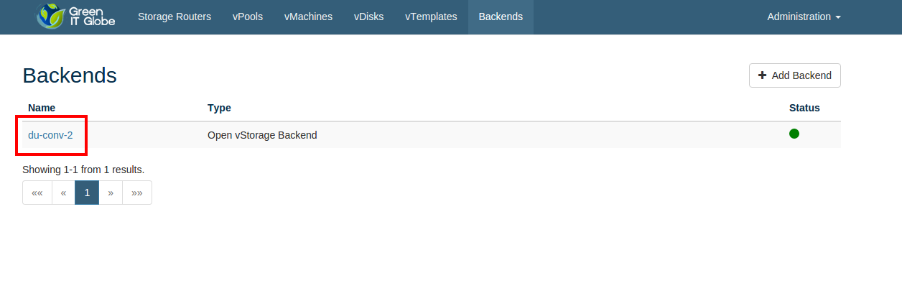
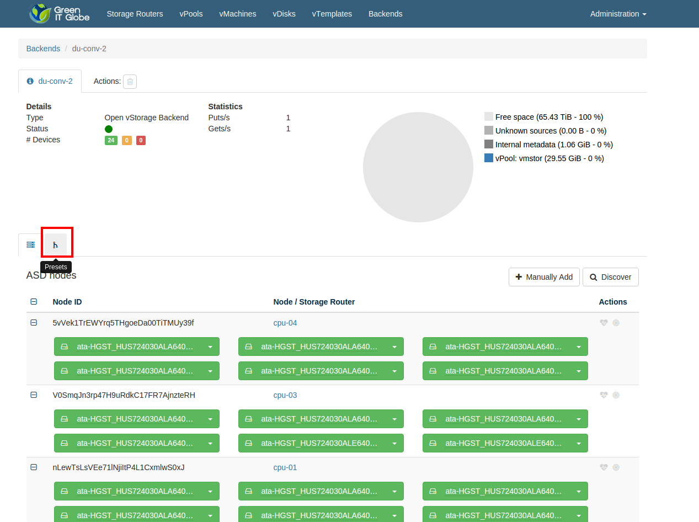
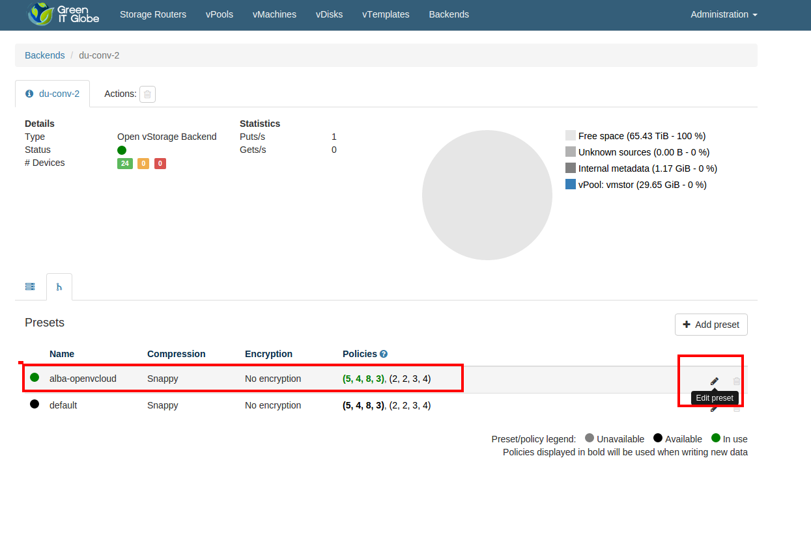
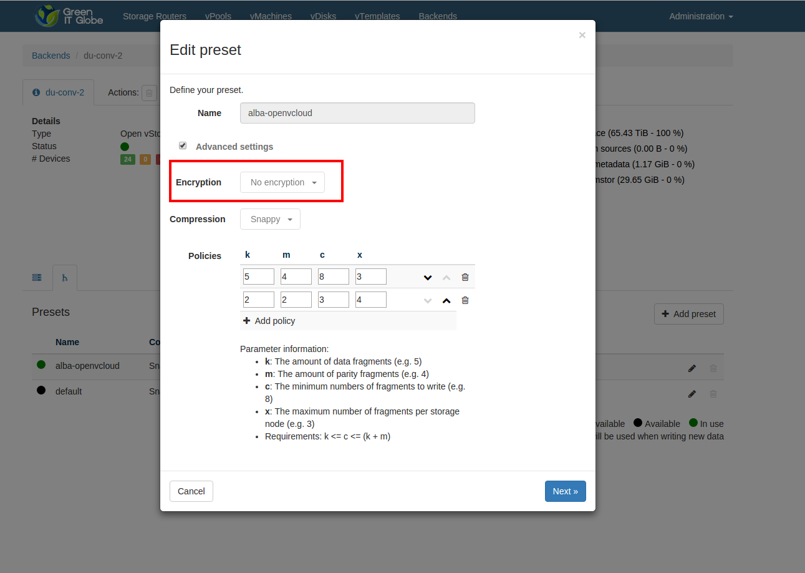
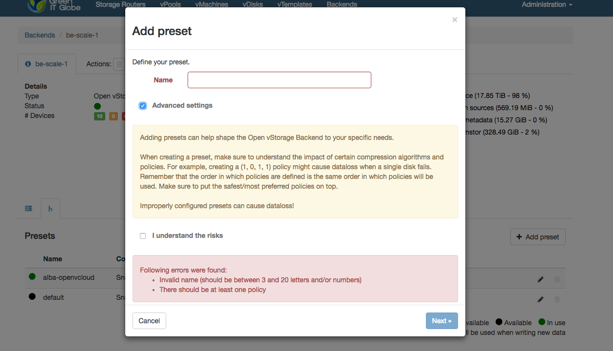
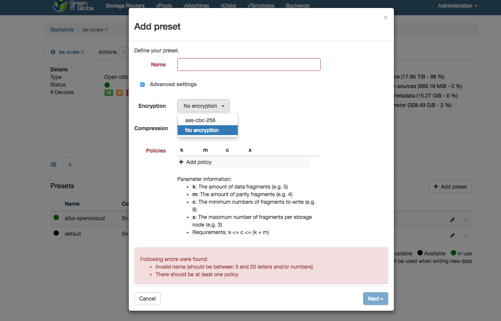

## Backend Encryption

Backend encryption is configured at the level of a **preset** policy.

To configure a preset:

- Click **Backends** in the **Storage Portal**:

  

- Select an environment:

  

- Click the **Presents** tab:

  

- Select a preset and click "Edit preset":

  

- Encryption cannot be enabled for an existing preset:

  

- Add a new preset by clicking **+ Add preset**, check **Advanced settings** and confirm **I understand the risks**:

  

- In the **Encryption** dropdown select **aes-cbc-256** in order to activate encryption:

  
