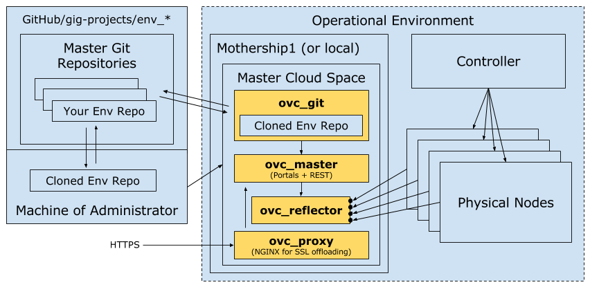

## How to Connect to an OpenvCloud Environment

### Introduction



The core of an OpenvCloud environment is the **master cloud space**, which consist of the following virtual machines or Docker containers:
- **ovc_git** holding all configuration of your environment
- **ovc_master** controlling the environment based on information from ovc\_git
- **ovc_reflector** provides [reverse SSH connections](https://en.wikipedia.org/wiki/Reverse_connection) to the physical nodes
- **ovc_proxy** running nginx as a proxy for all port 80 and port 443 communications

The master cloud space and its containers/virtual machines can run locally, close to the actual OpenvCloud physical nodes it controls or remotely, for instance in another OpenvCloud environment, such as at Mothership1.com.

When installed locally, Green IT Globe typically uses a mini PC such as the [Shuttle XPC nano NC01U5](http://www.shuttle.eu/products/nano/nc01u5/).

For each environment managed by Green IT Globe a master repository is maintained in the [github.com/0-complexity](https://github.com/0-complexity) or [github.com/gig-projects](https://github.com/gig-projects) GitHub organization. Access is of course restricted.As a partner or customer of Green IT Globe you might want to setup your own master repository, only accesible to your organization.

On ovc_git the master repository is cloned, holding all configuration information, including all the keys in order to access all other Docker containers and/or virtual machines of the master cloud space of your OpenvCloud environment.

So in order to access your OpenvCloud environment your GitHub user account should be granted access to the master repository in order to first clone the Git repository of your local machine, providing you the keys to access ovc\_git and all other Docker containers and/or virtual machines in the master cloud space, and update the configuration, which you will be pushing back to the central GitHub repository, from where it gets in turn pulled to ovc\_git, making your changes effective.


### Accessing ovc\_git

There are some prerequisites, all documented [here](preparing_for_indirect_access.md), explaining:
- How to get access to GitHub
- How to configure your GitHub accounts to use your personal SSH keys for authentication
- How to install and configure git on your personal computer

From a well prepared computer, as documented [here](preparing_for_indirect_access.md), your first step will be to clone the repository from GitHub to your local (virtual) machine:
```
git clone git@github.com:0-complexity/be-scale-1.git
```

If the repository was already cloned previously on your machines, pull the latest update from the directory where it was cloned previously:
```
git pull
```

Make sure the cloned keys file is protected, not accessible to other users, it should be "-rw --- ---" (600), not "rw- r-- r--" (644) for instance:
```
chmod 600 be-scale-1/keys/git_root
```

So you have the keys... next you will need the IP address of ovc\_git.

The ip address (instance.param.ip) is often (but not always) the same as the one that can be found in the service.hrd of

`/opt/code/github/$github-organization-name$/$name-of-your-env$/services/openvcloud__git_vm__main`

Or in case ovc\_git runs in a Docker container:

 `/opt/code/github/$github-organization-name$/$name-of-your-env$/services/jumpscale__docker_client__main`.

Since this address could be different, it's recommended to check with the administrator.

So, for instance for an environment with the name `poc`:
```
cd /opt/code/github/$github-organization-name$/poc/services/openvcloud\__git_vm__main
cat service.hrd
instance.param.ip              = '185.69.164.120'
instance.param.recovery.passwd = '1piQpVVt6z4U'

service.domain                 = 'openvcloud'
service.installed.checksum     = '87c2cf956d752bb9f9a8e485c383c39a'
service.instance               = 'main'
service.name                   = 'git_vm'
```

In order to connect to `ovc_git`, using the git_root identity file (-i) for this environment, and including the -A option (best practice):

```
ssh root@185.69.164.120 -A -i /opt/code/github/$github-organization-name$/poc/keys/git_root
root@ovcgit:~#
```

Or in case ovc_git runs in a Docker container:

```
ssh 10.54.16.7 -l root -A -p 2202 -i /opt/code/github/$github-organization-name$/poc/keys/git_root
root@ovcgit:~#
```

Now that you are on ovc\_git you can access ovc\_master and the physical nodes from there, both discussed below.


### Accessing ovc\_master from ovc\_git

The public IP address (instance.ip) of ovc\_master can be found on ovc\_git in `/opt/code/github/$github-organization-name$/$name-of-your-env$/services/jumpscale__node.ssh__ovc_master`.

For instance for an environment with the name `poc`:
```
cd /opt/code/git/$github-organization-name$/poc/services/jumpscale__node.ssh__ovc_master
cat service.hrd
instance.ip                    = '172.17.0.4'
instance.jumpscale             = 'False'
instance.login                 = 'root'
instance.password              =
instance.publicip              = '10.54.16.7'
instance.ssh.port              = '22'
instance.ssh.publicport        = '9022'
instance.ssh.shell             = '/bin/bash -l -c'
instance.sshkey                = 'ovc_master'

#optional category of service, default = app
service.category               = 'node'
service.description            = 'is a node running linux os'
service.domain                 = 'jumpscale'
service.installed.checksum     = '85a4417a78f8acd43669a1f479bb17b0'
service.instance               = 'ovc_master'
service.name                   = 'node.ssh'root@anotherubuntuserver:/opt/code/git/openvcloudEnvironments/poc/services/jumpscale__node.ssh__ovc_master#
```

The ip address next to `instance.ip` is the one you need, in the above example that is 172.17.0.4.

Connecting to ovc\_master from ovc\_git is simple then:
```
ssh 172.17.0.4 -A
```


### Accessing physical nodes from ovc_git

All ip addresses (instance.ip) of the physical nodes can be found on ovc\_git in `/opt/code/git/openvcloudEnvironments/$name-of-your-env$/services/jumpscale__node.ssh__$name-of-physical-node$/service.hrd`.

For instance for an physical node with the name `be-scale-1-01` in an environment with name `be-scale-1`:
```
cd /opt/code/git/openvcloudEnvironments/be-scale-1/services/jumpscale__node.ssh__be-scale-1-01
cat service.hrd
instance.ip                    = '192.168.103.218'
instance.jumpscale             = 'False'
instance.login                 = 'root'
instance.password              =
instance.ssh.port              = '21001'
instance.ssh.shell             = '/bin/bash -l -c'
instance.sshkey                = 'nodes'

#optional category of service, default = app
service.category               = 'node'
service.description            = 'is a node running linux os'
service.domain                 = 'jumpscale'
service.installed.checksum     = '85a4417a78f8acd43669a1f479bb17b0'
service.instance               = 'be-scale-1-01'
service.name                   = 'node.ssh'root@ovcgit:/opt/code/git/openvcloudEnvironments/be-scale-1/services/jumpscale__node.ssh__be-scale-1-01#
```

Connecting from ovc_git to physical node be-scale-1-01 is as simple as:
```
ssh 192.168.103.218
```