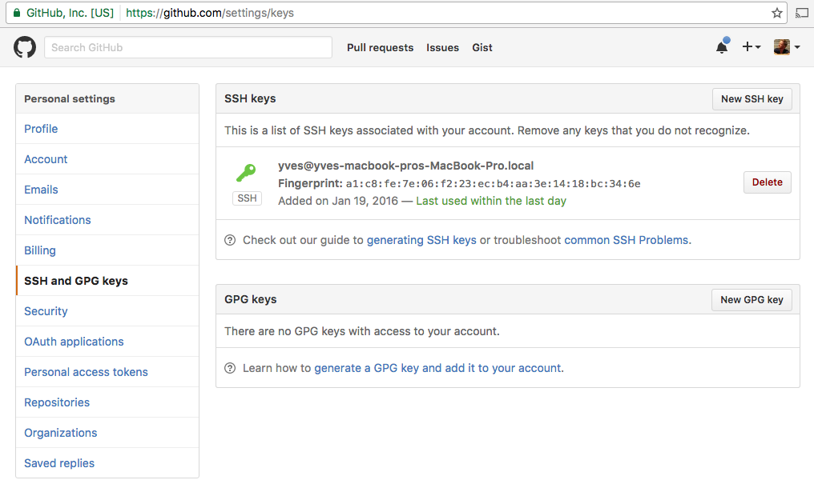

## Preparing Before Connecting

### Getting access to the Git repository of the targeted environment

The below documentation assumes that the master Git repository for your environment is maintained in a GitHub organization.

Using GitHub is however not a prerequisite, any other public or private Git repository hosting service can be used.

In all cases you will need access to the repository in order to be able to manage an OpenvCloud environment.


### Configure your GitHub account to use your SSH key for authentication

All the steps below should be executed from a physical or virtual machine running Ubuntu.

On that machine make sure to run all your commands with root privileges:

```
sudo -i
```

Check whether you have existing SSH keys:

```
ls -al ~/.ssh
```

If you started with a *fresh* virtual machine running Ubuntu, you will get following output:

```
root@your-machine:~# ls -al ~/.ssh
total 8
drwx------ 2 root root 4096 Dec 22 14:56 .
drwx------ 3 root root 4096 Dec 22 15:02 ..
-rw------- 1 root root    0 Dec 22 14:56 authorized_keys
```

In that case, or in case you receive an error that `~/.ssh` doesn't exist, you will need to create your SHH keys:

```
ssh-keygen -t rsa
```

This starts the key generation process. When you execute this command, the **ssh-keygen** utility prompts you to indicate where to store the keys.

Press the ENTER key to accept the default location. The **ssh-keygen** utility prompts you for a passphrase.

Type in a passphrase. You can also hit the ENTER key to accept the default (no passphrase). However, this is not recommended.

After you confirm the passphrase, the system generates the key pair:
- Your private key is saved to the `id_rsa file` in the `.ssh` directory
- Your public key is saved to the `id_rsa.pub` file

Now add your private SSH key to the ssh-agent, by first making sure ssh-agent is running, and then actually adding them:

```
eval $(ssh-agent)
ssh-add ~/.ssh/id_rsa
```

Display the generated public key, so you can easily copy it:

```
cat ~/.ssh/id_rsa.pub
```

Finally make sure that your public key is registered at GitHub, by copying the public key from `~/.ssh/id_rsa.pub` to GitHub: https://github.com/settings/ssh

Below a screenshot:



Of course, in case you already have an existing public and private key pair that you would like to use to connect to GitHub, make sure that you register that one instead of creating a new one.


### Install and configure Git on your computer

```
sudo apt-get update
sudo apt-get install git
```

This will download and install git on your system...

Once installed, you need to do a few things so that the commit messages that will be generated for you will contain your correct information.

The easiest way of doing this is through the git config command. Specifically, you need to provide your name and email address because git embeds this information into each commit we do. We can go ahead and add this information by typing:

```
git config --global user.name "Your Name"
git config --global user.email "youremail@domain.com"
```

You can verify all of the configuration items that have been set by typing:

```
git config --list
```

```
user.name=Yves Kerwyn
user.email=yves.kerwyn@greenitglobe.com
```

This information is stored in the the configuration file for Git, which you can optionally edit:

```
vi ~/.gitconfig
```

```
[user]
	name = Yves Kerwyn
	email = yves.kerwyn@greenitglobe.com
```

You're ready now to connect to an OpenvCloud environment over SSH, just remember to use the -A option in order to have the ssh agent forwarding to work:

```
ssh -A -p $port$ root@$ip-address
```

In order to verify that the ssh agent forwarding works, make sure that the following command shows the same key when running on your personal (local) machine and the remote machine:

```
ssh-add -l
```
