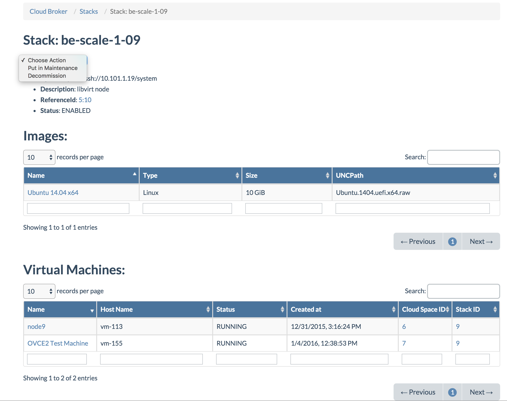
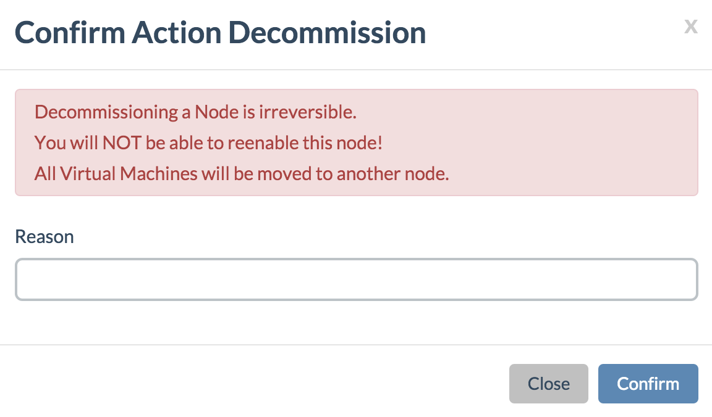

## Decommission a Node

You will want to decommission a node when a node is really broken, and can not be fixed by hot swapping hard drives and/or rebooting, i.e. when you need to replace an SSD.

You decommission a node by first selecting the node from the **Stacks** page in the **Cloud Broker Portal**, and choosing **Decommission** from the **Action** menu on the **Stack Details** page for the broken node:

> Level2 or Level3 group membership is required in order to be able to use this action

Before confirming the decommissioning, make sure your are really sure, since this action is irreversible:

