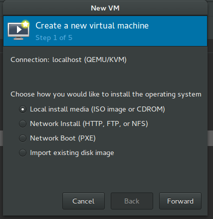
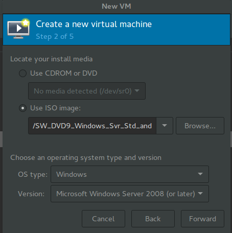
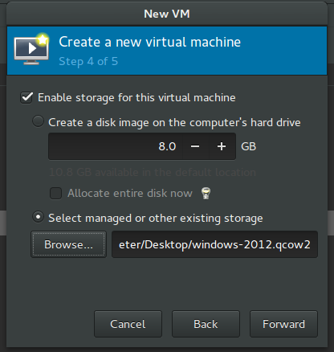
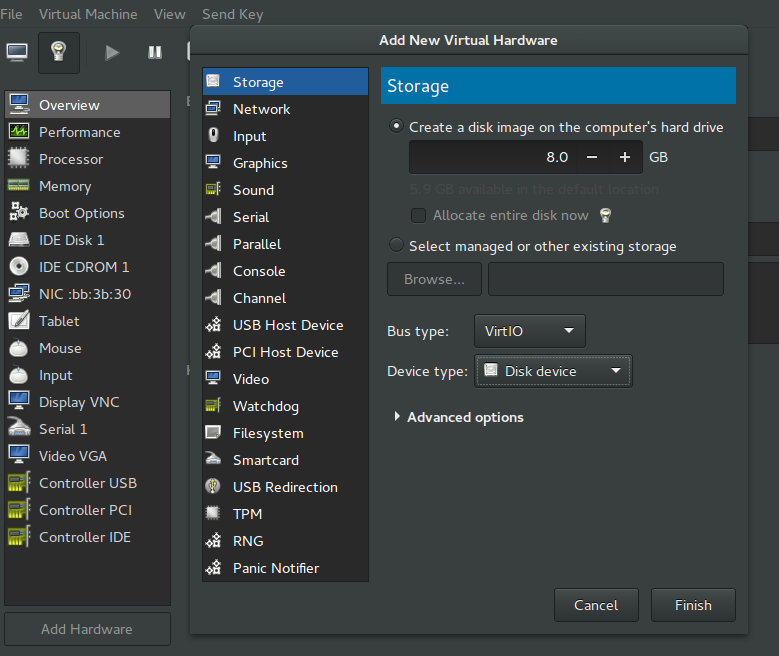
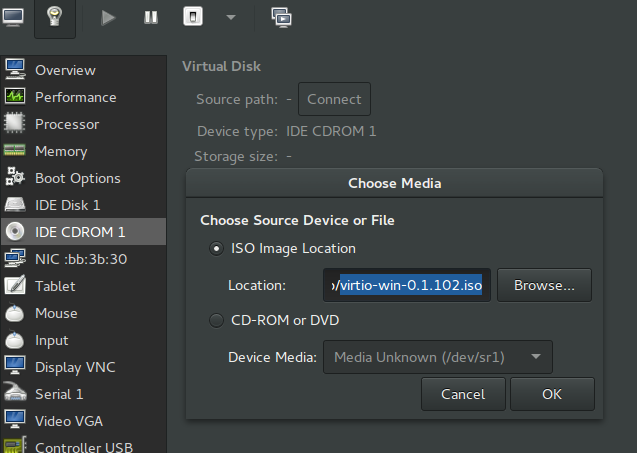
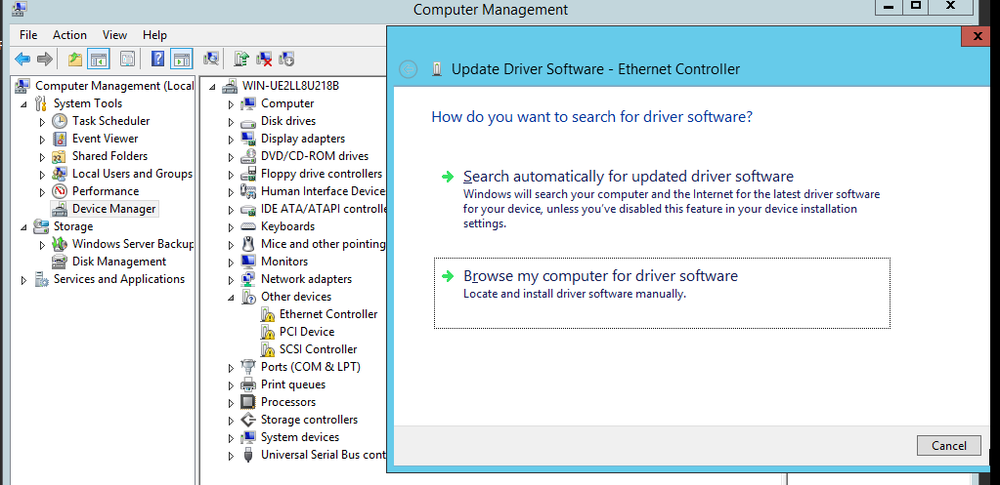
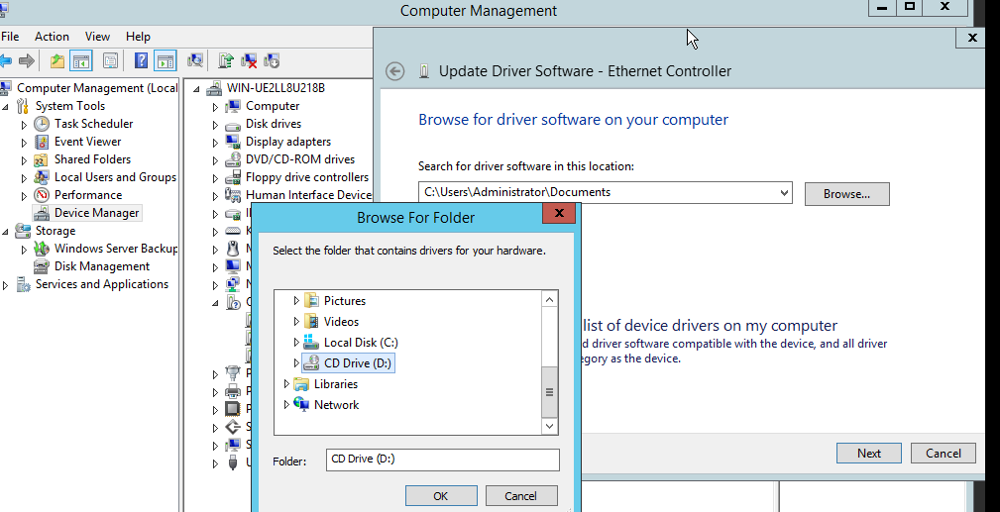
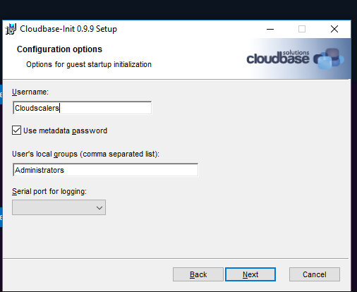

## How to Create a New Windows Image

This example creates a **Windows Server 2012** [qcow2](https://en.wikipedia.org/wiki/Qcow) image, using [virt-manager](https://virt-manager.org/).

Follow these steps to prepare the installation:

- Download a **Windows Server 2012** installation ISO. Evaluation images are available from the [Microsoft website](http://www.microsoft.com/en-us/evalcenter/evaluate-windows-server-2012) (registration required).

- Download the signed **VirtIO** drivers ISO from the [Fedora website](https://fedoraproject.org/wiki/Windows_Virtio_Drivers#Direct_download).

- Create a 25 GB qcow2 image:

  ```
  $ qemu-img create -f qcow2 windows-2012.qcow2 25G
  ```


### Now you are ready for creating the image

  - First start virt-manager

  

  

  - Then choose memory and CPU settings that suits you then hit **Forward**

  - For the storage browse and choose the windows-2012.qcow2 image your created earlier, then click **Forward**

  

  - Then click **Finish** and start installing the image


### After finishing the installation of the image, and shutting the machine down

From Add Hardware:

* First add **New Storage** and make sure that the Bus type is VirtIO

  

* Second add **Network** device and make sure that the device model is VirtIO

  

* Then add the VirtIO image that you downloaded earlier:

  


### Now you can start your machine

From **Server Manager** on Tools choose computer management and from it

  * Go to **Device Kanager** and try to install the new drivers you added before with the VirtIO image you connected the virtual machine with:

  

  * Choose **Browse my computer for driver software**:

  

  * Then browse for the virtio image that you will find loaded on CD Drive (D:), hit **Next**, and then **Install**


Repeat all  previous steps for all uninstalled drivers.


### Shutdown the virtual machine and remove the network and storage devices we added before and change the original network and storage devices into VirtIO

Now go to your virtual machine web browser and download Cloudbase init from this [link](https://cloudbase.it/cloudbase-init/).

While installing add Cloudscalers as a new user:




### After that we have to make some changes in 2 files

* First goto `C:\Program Files\Cloudbase Solutions\Cloudbase-Init\conf`

 - Open `cloudbase-init.conf` file and add this at the end of it:
  ```
      metadata_services=cloudbaseinit.metadata.services.configdrive.ConfigDriveService
  ```

* The second file is in `C:\Program Files\Cloudbase Solutions\Cloudbase-Init\Python\Lib\site-packages\cloudbaseinit\plugins\common`

  - Edit `setuserpassword.py` and change:

    ```
    cfg.StrOpt('first_logon_behaviour', default=CLEAR_TEXT_INJECTED_ONLY,
    ```
    To:
    ```
    cfg.StrOpt('first_logon_behaviour', default=NEVER_CHANGE,
    ```

### Then go to services and start the Cloud Initialization Service service

Shutdown the virtual machine.

### You are now good to go
