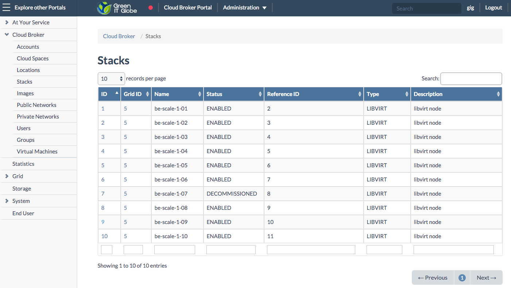
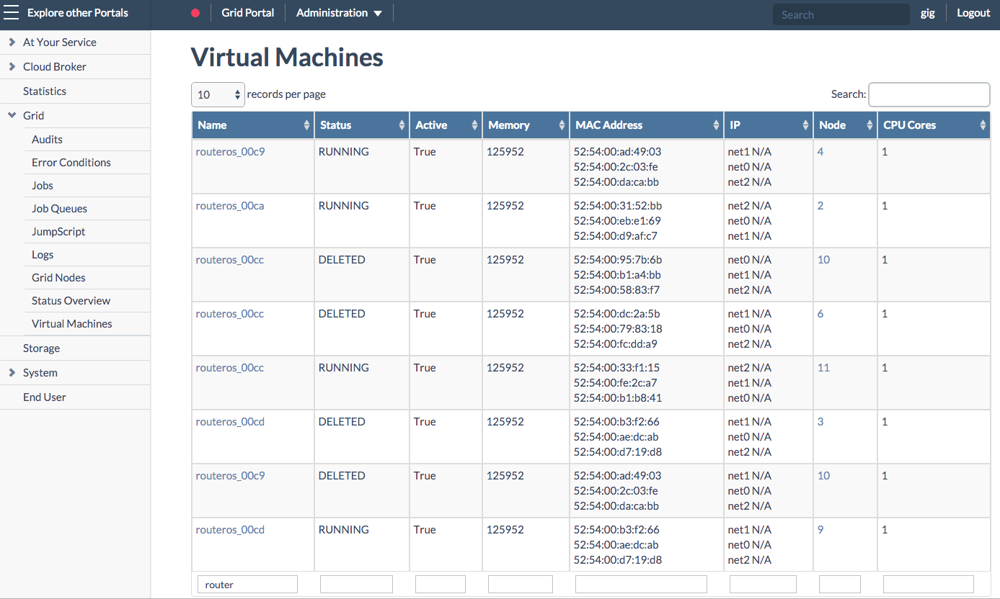
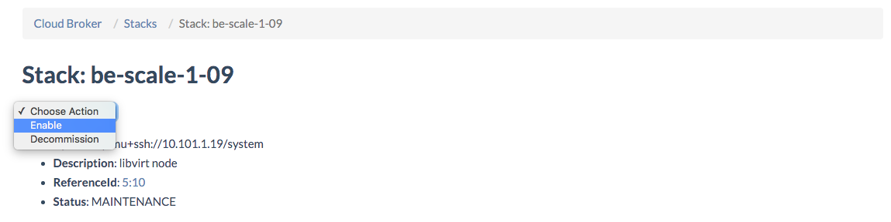

## Putting a Node in Maintenance Mode

You will want to put a node in **Maintenance Mode** as part of the process of physically rebooting the node. This in order to minimize the impact of the planned reboot.

This is done in three steps:
- [Go to the Stack Details page](#node)
- [Select the Put in Maintenance action](#action)
- [Choose to stop or move all virtual machines](#move)

Once rebooted, there are some post reboot actions:
- [Check the Open vStorage services](#ovs)
- [Check the JumpScale services](#jumpscale)
- [Restart the virtual machines](#restart)


<a id="node"></a>
#### Go to the Stack Details page

In the **Cloud Broker Portal**, select the node you are about to reboot from the **Stacks** (nodes) overview page :




<a id="action"></a>
#### Select the Put in Maintenance action

On the **Stack Details** page select **Put in Maintenance** from the **Actions** menu in order to prevent creation of new virtual machines on this node:


> Note that **Level2** or **Level3** group membership is required in order to be able to use this action

<a id="move"></a>
#### Choose to stop or move all virtual machines

In the **Confirm Action Put in Maintenance** dialog window you have too options:

  - **Move All Virtual Machines** in order to have all running virtual machines currently hosted on the selected node moved to another node. As a result these virtual machines stay available during maintenance, hosted on other nodes. This is the preferred option since it also moves all system created virtual machines, particularly the virtual machines running the RouterOS operating system that are created for each cloud space, providing vital functions such as the virtual firewalls.

  - **Stop All Virtual Machines** which will just stop all running virtual machines currently hosted on the selected node. As a result, when reenabling the node (once maintenance is finished), all the stopped virtual machines will automatically get restarted on this node, while during maintenance the virtual machines are not available.

  


> **Important Warning**
>
> Be aware that the **Stopping All Virtual Machines** option also stops all virtual machines that are created by the system. These virtual machines are not listed on the  **Stack Details** page. This is particularly very dangerous for the virtual firewalls that are setup for each cloud space, as the system creates for each cloud space a virtual machine running the RouterOs operating system for this and other important purposes.
>
> Check the **Virtual Machines** page in the **Grid Portal** and filter on '*router*' to have an overview of all Virtual Firewalls and where they are running:

> 

**Note**

Alternatively you might prefer to manually move each or some of the virtual machines individually, allowing you to decide yourself to which node the virtual machines should be moved. Even in that case, after having moved some or all of the virtual machines manually, you still will want to use the **Move All Virtual Machines** option in order to make sure also the system-created virtual machines discussed above get moved, making sure all vital functionality provided by the RouterOS stays active.

In case you really prefer to do everything manually, you also move the system-created virtual machines your self, this by going to the **Private Network Details** page and using the **Move VFW** action.

<a id="post"></a>
### Post reboot actions

After the node is booted, it is highly recommended to perform some checks in order to make sure all Open vStorage and JumpScale services, and all virtual machines and virtual firewalls are up again:

- [Check the Open vStorage services](#ovs)
- [Check the JumpScale services](#jumpscale)
- [Restart the virtual machines](#restart)


<a id="ovs"></a>
#### Open vStorage

```
ovs monitor services

OVS running processes:

network-interface (ovs-system) start/running
network-interface-security (network-interface/ovs-system) start/running
ovs-alba-maintenance_be-conv-2 start/running, process 2065
ovs-albaproxy_vmstor start/running, process 3653
ovs-alba-rebalancer_be-conv-2 start/running, process 2082
ovs-arakoon-be-conv-2-abm start/running, process 2059
ovs-arakoon-be-conv-2-nsm_0 start/running, process 2062
ovs-arakoon-be-conv-2-nsm_1 start/running, process 2060
ovs-arakoon-be-conv-2-nsm_2 start/running, process 2109
ovs-arakoon-ovsdb start/running, process 2061
ovs-arakoon-voldrv start/running, process 2063
ovs-dtl_vmstor start/running, process 3644
ovs-scheduled-tasks start/running, process 3675
ovs-snmp start/running, process 18091
ovs-volumedriver_vmstor start/running, process 3657
ovs-volumerouter-consumer start/running, process 3673
ovs-watcher-framework start/running, process 3669
ovs-watcher-volumedriver start/running, process 3642
ovs-webapp-api start/running, process 3676
ovs-workers start/running, process 3799

OVS non-running processes:
```

All services should be running. If this is not the case try to start them with the below command:

```
ovs start services
```

<a id="jumpscale"></a>
#### JumpScale Services

```
ays status

ays status
DOMAIN          NAME                 Instance   Prio Status   Ports
======================================================================

jumpscale       autossh              be-conv-2-01    1 RUNNING
jumpscale       autossh              http_proxy    1 RUNNING
jumpscale       redis                system        1 RUNNING  9999
jumpscale       statsd-collector     main          5 RUNNING  8126
jumpscale       nginx                main         50 RUNNING
jumpscale       jsagent              main        100 RUNNING  4446
openvcloud      vncproxy             main        100 RUNNING  8091
```

All services should be running if this is not the cat try to start them with

```
ays start
```

<a id="restart"></a>
#### Restart virtual machines and virtual firewalls

Virtual machines and virtual firewalls are not automatically restarted after a reboot, a manual restart is required.

This can be accomplished by putting the node back **Enabled** mode. In order to do so select **Enable** from the **Actions** menu on the **Stack Details** page of the rebooted node:



> Level2 or Level3 group membership is required in order to be able to use this action

If you previously have chosen for the **Stop All Virtual Machines** option, instead of the **Move All Virtual Machines** option, then all the stopped virtual machines and virtual firewalls will restart on this node; so no need to restart them one by one.


##### Manually start the virtual machines and virtual firewalls

In case you prefer to manually start/restart the virtual machines, including the system-created virtual machines running the firewalls, you might want to use following command line instructions:

```
virsh list --all

for vm in `virsh list --all | grep shut | awk '{print $2}'`; do
virsh start $vm
done
```
