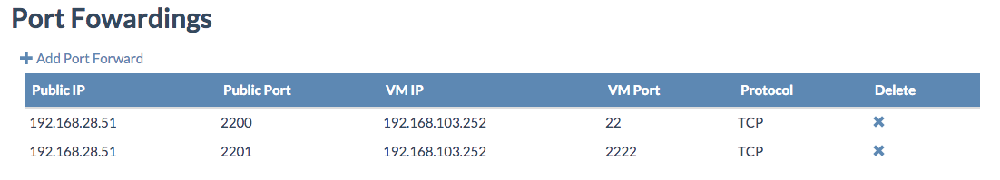
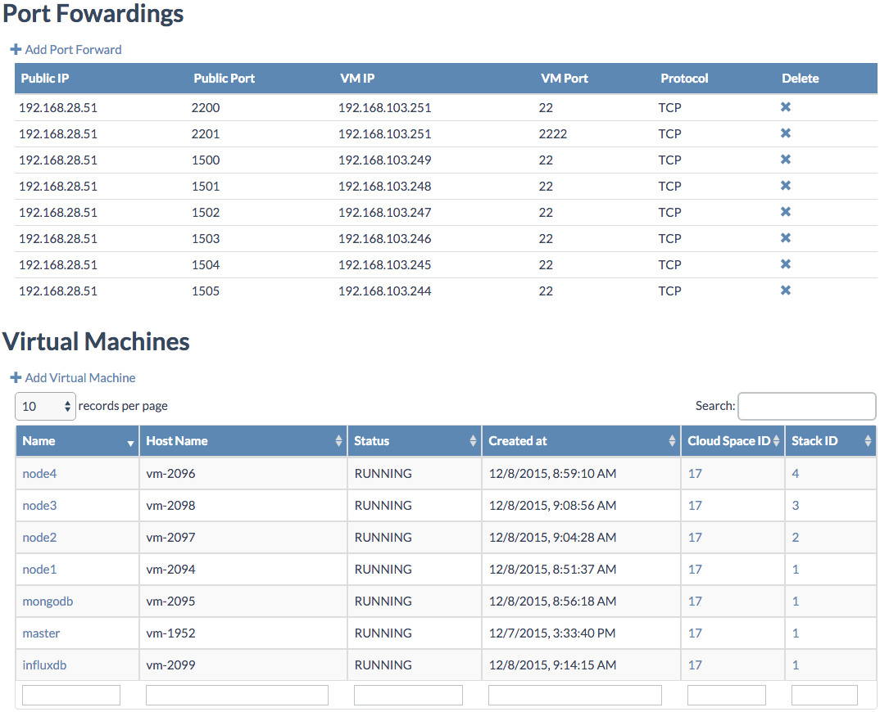

## Setup the Stress Test Virtual Machines

This step can be performed multiple times per environment.

Make sure to have first setup the Stress Test Cloud Space, using the [Bootstrap](bootstrap.md) script.

The next step will be to the creation of all the virtual machines needed for the tests. On each node a virtual machine will be deployed, including the application needed for the performance test.

The setup script needs to be run from the docker container hosted in the master virtual machine that got installed by the bootstrap script.

The virtual machines can be created in any cloud space you choose, just make sure that the system account (created by the bootstrap script) has access administrative access to you cloud space.

From a well prepared computer, as documented [here](../../Sysadmin/preparing_for_indirect_access.md), before connecting to the docker container, let's make sure `ssh-agent` is running, and that your SSH keys are added:
```
ssh-add -l
```

If not, when getting the error `Could not open a connection to your authentication agent.`:
```
eval $(ssh-agent -s)
ssh-add $HOME/.ssh/id_rsa
```

Also make sure that your SHH public key is registered at both git.aydo.com and www.github.com.

In order to connect to the docker container, you will need the IP address of the master virtual machine, hosting the docker container, which can be found in the **Cloud Broker Portal** on the **Virtual Machine Details** page for your `master` virtual machine, where you also see the port forwardings setup by the bootstrap script:



Let's now connect, forwarding your current authentication agent connection by using the -A option:
```
ssh root@$ip-address-of-ovc_master$ -p 2201 -A
```

The password for root is gig1234.

The -A option is critical in order for the setup script to work. It enables forwarding of the authentication agent connection. Of course this requires that the ssh authentication agent (ssh-agent) is running in the first place. Moreover your public key needs to be registered on both registered github.com and git.aydo.

Now your are ready to run the actual installation script. The below command is for the environment *`du-conv-3.demo.greenitglobe.com`* on location *`dev`*, having 4 nodes (stacks):
```
cd /opt/code/git/0-complexity/ays_stresstest/scripts
jspython setup.py --url du-conv-2.demo.greenitglobe.com --login system --password gig1234 --location du-conv-2 --cloudspace default --stacks 1,2,3,4
```

Alternatively you can also specify `--stacks 1-4` instead.

Again, remember to adapt the command to your environment:
- Replacing *'du-conv-2.demo.greenitglobe.com'* with the url of the environment you want to perform the test on.
- Replace *'du-conv-2'* with the actual location name of the location, which can be looked up in the **Cloud Broker Portal** under **Locations**.
- Add the total number of nodes after *'stacks'*  

When get time out errors, simply re-run the setup script, it will pick-up where it left.

If everything went well a number of virtual machines will have been created:

- **Influxdb** containing a docker container of this image https://github.com/Jumpscale/docker_influxdb and a docker container of this image https://github.com/Jumpscale/docker_redis
- **Mongodb** containing a docker container of this image https://github.com/Jumpscale/docker_mongo
- For each node specified in the setup script with the option --stacks a virtual machine generating the actual stress test workloads

In the **Cloud Broker Portal** you should see following setup:

