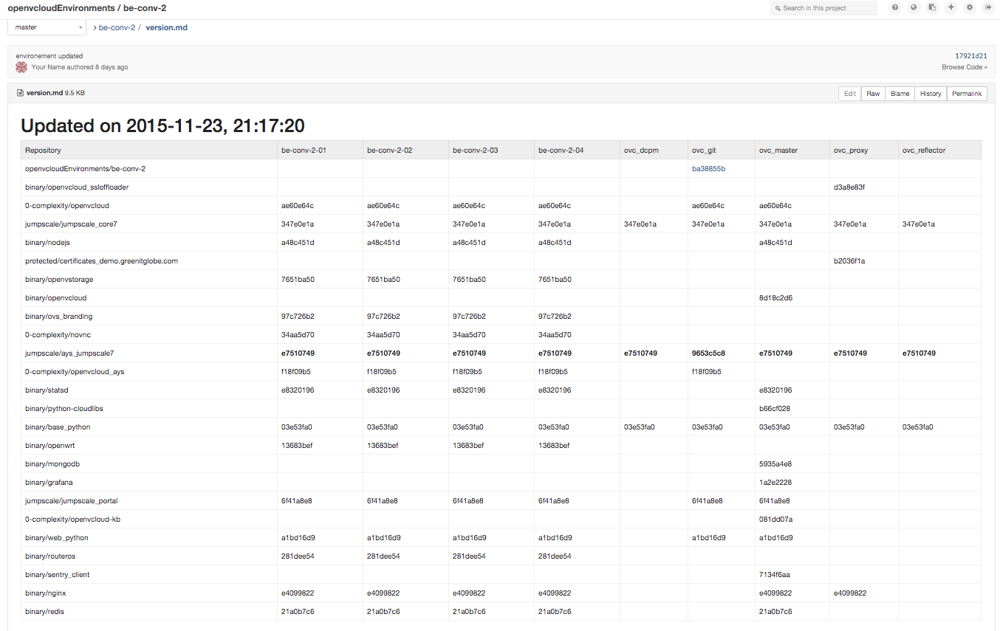

## Commit Changes

Still on ovc-git execute the following command to build a version log and update the git `version.md`:
```bash
jspython /opt/code/github/0-complexity/openvcloud/scripts/updates/update-ays.py --report
```

This will update `version.md` on the central repository for your environment, below the one for be-conv-2, as available on https://git.aydo.com/openvcloudEnvironments/be-conv-2/blob/master/version.md:



Execute the following command to commit the local ovc_git repository:
```bash
jspython /opt/code/github/0-complexity/openvcloud/scripts/updates/update-ays.py --commit
```

Your final step will be to [update Open vStorage](../OVS/update_ovs.md).