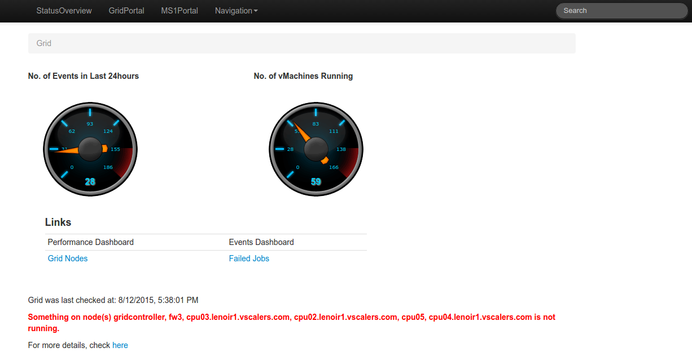
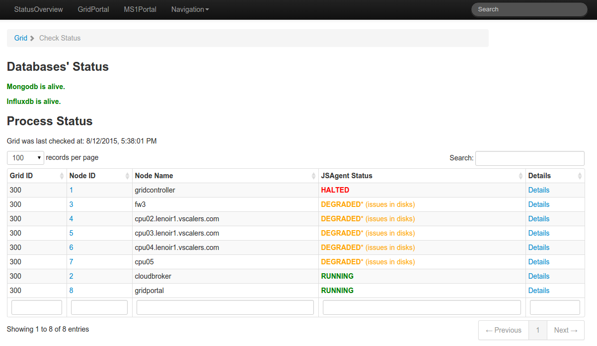
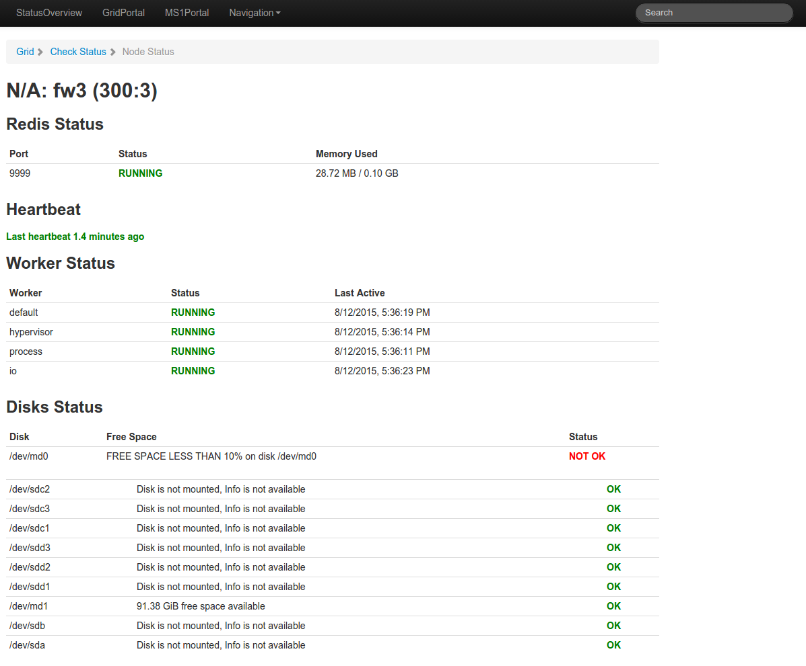

# Grid HealthCheck

One of the most obvious and important concerns of any grid manager is being able to check if all nodes of a grid are healthy or not and pinpoint any problems easily and efficiently.

The grid healthchecker runs periodically, ascertaining just that.

## Grid healthchecker checks on:

- That all nodes are ping-able synchoronously and asynchronously.
- All nodes have a heartbeat (have reported to the master node within the last two minutes).
- All nodes have redis running and have suffecient memory.
- All nodes' disks have more than 10% of disk space available.
- All nodes' jsagents are running and reachable.
- All nodes' workers are running.
- All nodes' databases are reachable.

## Ways to monitoring your grid's health:

- Check raised warnings and errors. The grid healthcheker runs periodically and raises different errors depending on severity.
- Run `jsgrid healthcheck` from the command line. Optionally add `--nodeid` with the node ID you want checked if not all.
- Run `j.core.grid.healthchecker.runAll()` from the jsshell
- Run `j.core.grid.healthchecker.runAllOnNode(nodeid)` from jsshell to check the health of only one specific node.
- Check the GridPortal landing page (<http://localhost:82/grid>) for an overview of the grid's health.

- Check the GridPortals StatusCheck (<http://localhost:82/grid/checkstatus>) page for a more detailed status. 

- For an even more detailed report on the health of each node, check the NodeStatus (<http://localhost:82/grid/NodeStatus?nid=1&gid=1> (Make sure to use your own grid ID and node ID)) 
