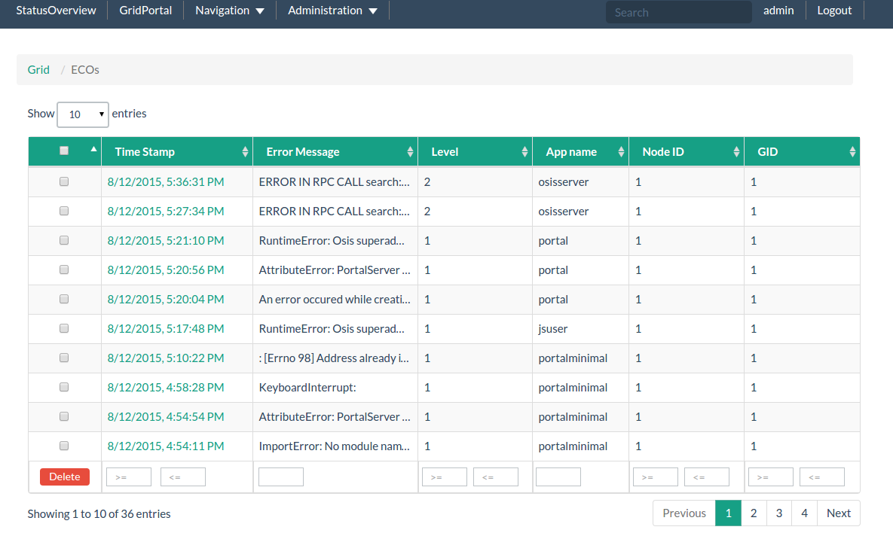

# Error Condition Objects

An overview of ECOs reported anywhere in the grid is shown in the ECOs page 

<http:localhost:82 grid="" ecos="">. </http:localhost:82>

This is particularly useful in hunting down any issues that pop up.

The ECOs are sortable and filterable by time of occurrence, level, originating app name, node ID and grid ID (its address in essence).

Each of the ECOs further show helpful details such as backtraces, files where they occurred, number of occurrences, first and last occurrences and more.
