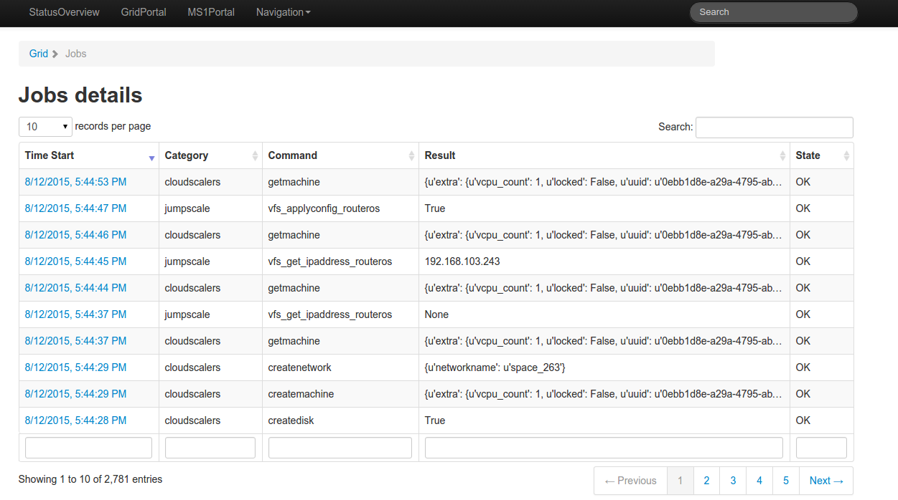
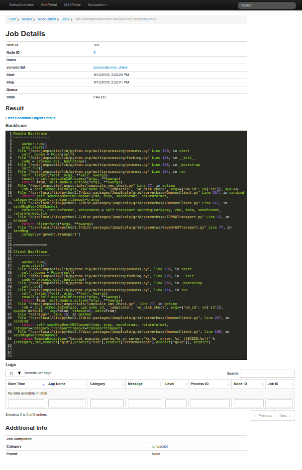

# Jobs

An overview of all jobs that ran on all nodes on the grid are shown under [http:localhost:82/Grid/Jobs](http:localhost:82/grid/Jobs)

Jobs are sortable and filterable by time of occurrence, command, result and STATE.

Further details show Grid and node IDs where the job ran, roles the job ran by, the executed [JumpScript](../AgentController8/JumpScript.md) if one was, which queue the job ran on and logs from the job.

Job states can be:

- "OK" for jobs that have been executed successfully.
- "ERROR" for jobs that have failed.
- "TIMEOUT" for jobs that have timed out.
- "SCHEDULED" for jobs that have not yet run.
