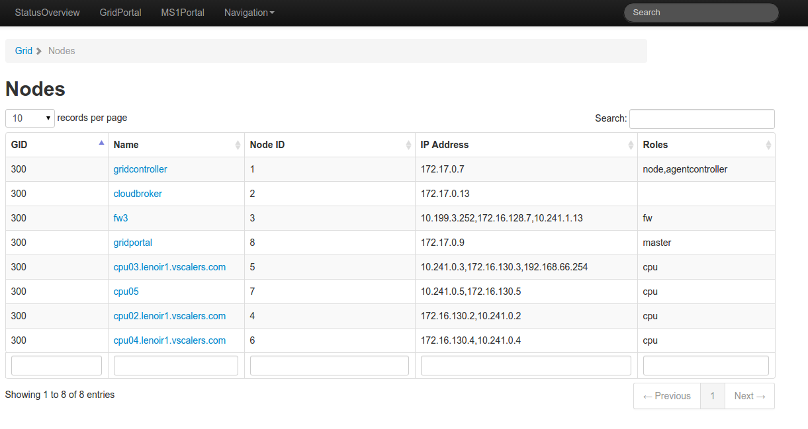

# Nodes

An overview of all nodes in a set up. Shown under [http:localhost:82/Grid/Nodes](http:localhost:82/grid/Nodes) 

Nodes are sortable and filterable by grid and node IDs, node name, roles the nodes have and their IPs.

Further details show the node's CPU statistics, more detailed information about it, node statistics, network interfaces, [Jobs](Jobs.md) running on that node, node machines, logs, [Errors](Errors.md) and node disks.
